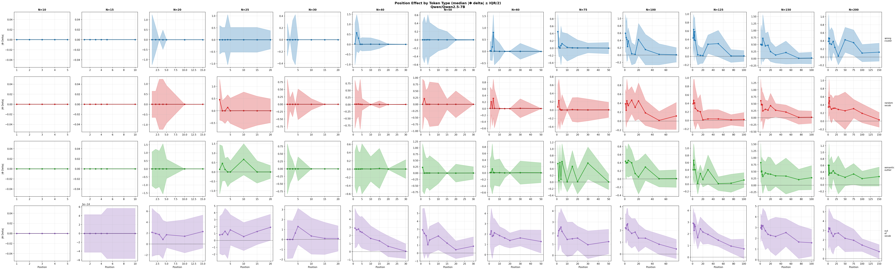
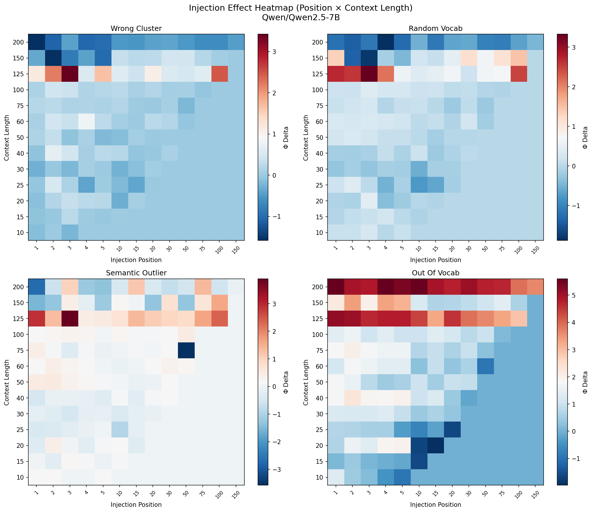
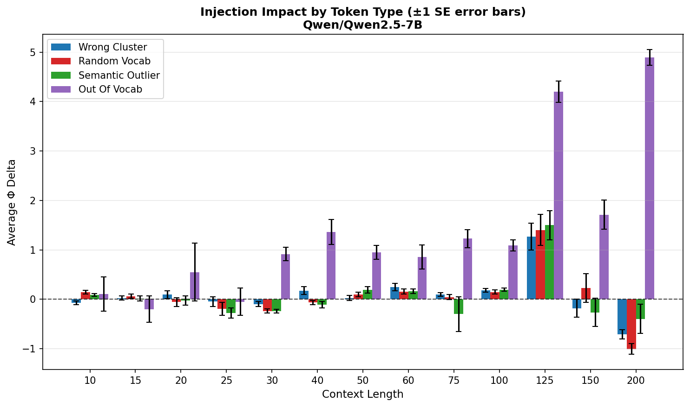

# Experiment: Incongruous Token Injection (Fine Granularity)

**Date**: 2026-01-21
**Model**: Qwen/Qwen2.5-7B (28 layers)
**W&B Run**: https://wandb.ai/thomasjiralerspong/icl-structural-influence/runs/rt948v8b

## Objective

Investigate how a single incongruous token affects representations at different positions in the context, with fine granularity across context lengths to identify phase transitions.

## Configuration

- **Context lengths**: 10, 15, 20, 25, 30, 40, 50, 60, 75, 100, 125, 150, 200 (13 values)
- **N samples**: 30 per context length
- **Layers tested**: [0, 4, 8, 12, 16, 20, 24, 27]
- **Token types**: wrong_cluster, random_vocab, semantic_outlier, out_of_vocab
- **Position granularity**: Fine early (1,2,3,4,5), then 10,15,20,30,50,75,100,150

## Key Results

- **Most disruptive token type**: `out_of_vocab` (median |Φ delta| = 1.74)
- **Wrong cluster tokens**: Early injection less disruptive (0.023) than late (0.121) - ratio 0.19
- **Semantic outliers**: Early median |Φ Δ| = 0.14, Late = 0.26 - ratio 0.55
- **Pattern**: Late injection consistently more disruptive than early injection across all token types

## Figures

### Position Effect by Token Type

Shows how the structural impact (|Φ delta|) varies by injection position for each context length. Early positions (1-5) have fine granularity.

### Position vs Context Length Heatmap

2D view of injection effects across position (x-axis) and context length (y-axis) for each token type.

### Layer Sensitivity Analysis

Left: Early vs late injection effects by layer. Right: Model surprise (loss) at incongruous tokens by position.

### Token Type Comparison

Average Φ delta by token type across context lengths.

## Raw Data

- Results JSON: `results/incongruous_injection_fine/injection_results_Qwen_Qwen2.5-7B.json`

## Notes

- Uses bounded Φ metric (eps=1e-3) to prevent extreme ratio values
- Fine context length granularity (step ~10-25) helps identify phase transition regions
- Early positions (1-5) tested at every position for detailed early-context analysis
- 390 total experiment iterations (13 context lengths × 30 samples)
