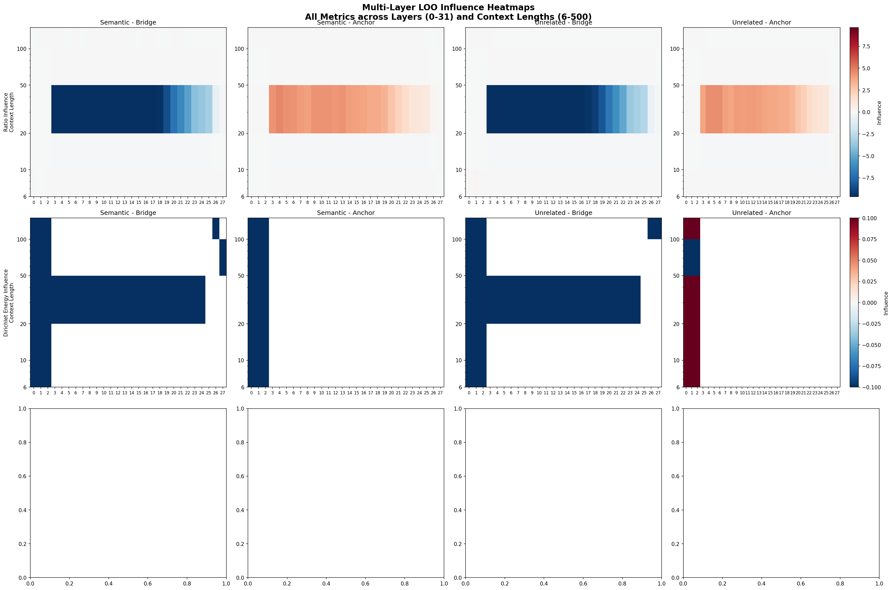
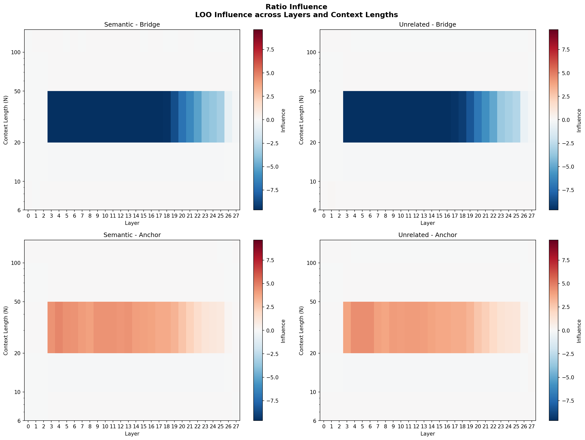
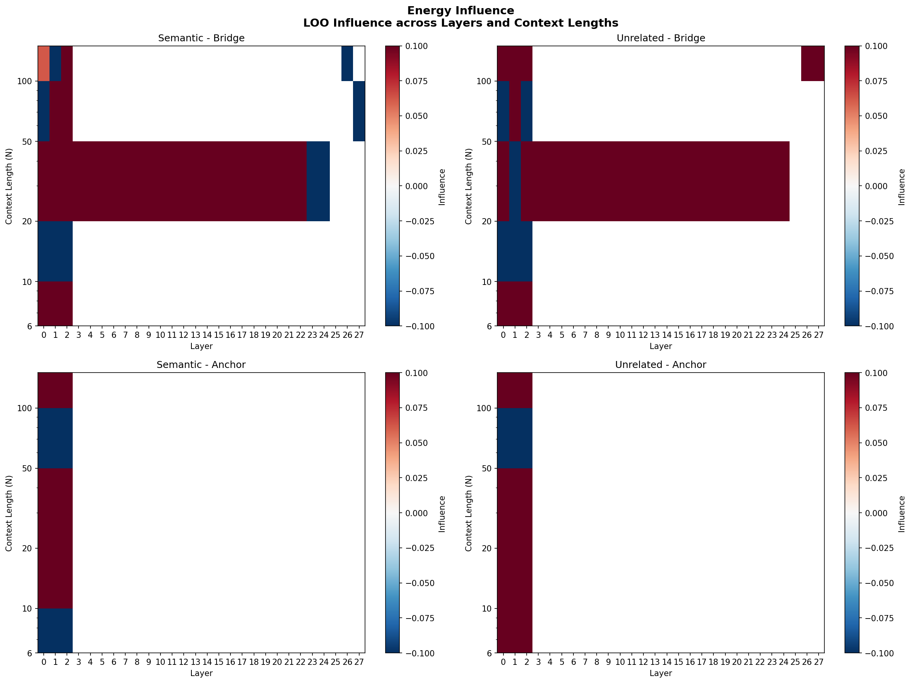
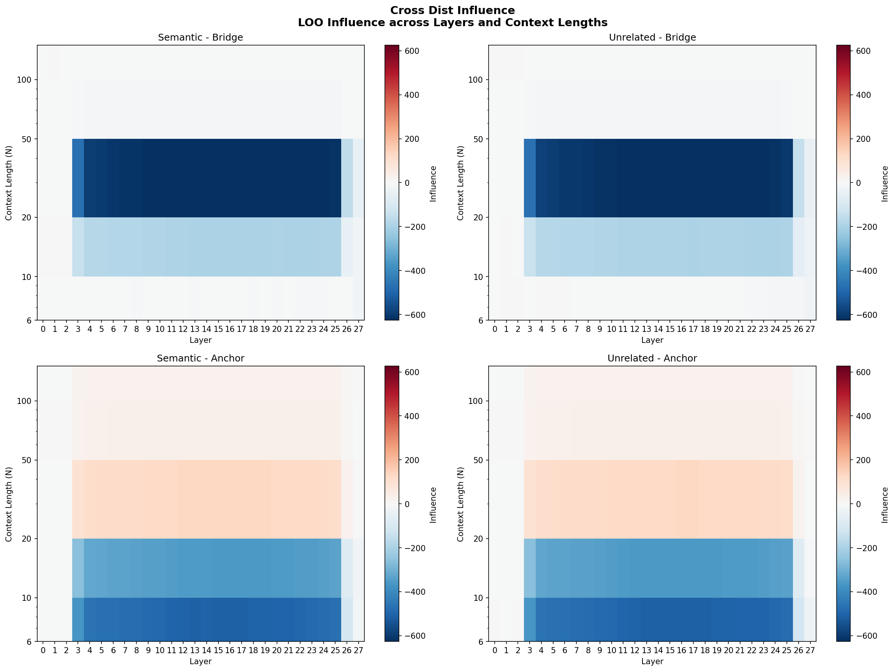
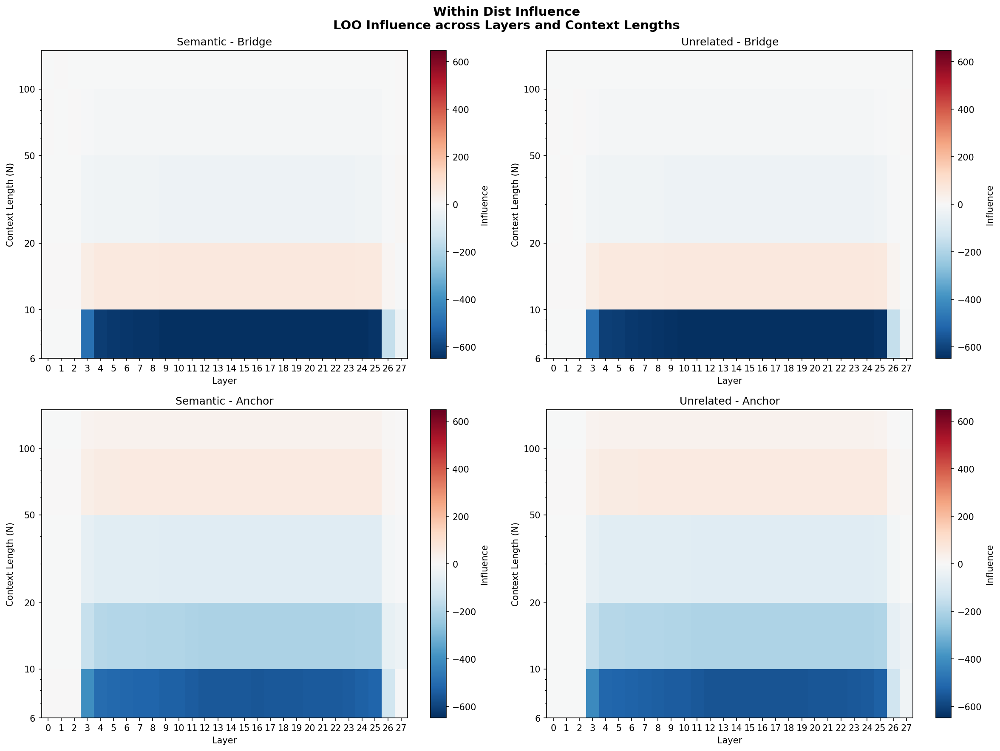

# Experiment: Multi-Layer LOO Influence with Bounded Phi Metric

**Date**: 2026-01-21
**Model**: Qwen/Qwen2.5-7B (28 layers)
**W&B Run**: https://wandb.ai/thomasjiralerspong/icl-structural-influence/runs/qfwyoros

## Objective

Test Leave-One-Out (LOO) influence across all model layers with the newly implemented bounded Phi (cluster separation) metric. The bounded metric uses a relative epsilon (`eps=1e-3`) to prevent extreme ratio values when within-cluster distances approach zero.

## Configuration

- Context lengths: 6, 10, 20, 50, 100
- N trials: 5
- Layers tested: All 28 layers (0-27)
- Token conditions: Both semantic and unrelated

## Key Results

- **Bounded ratios working correctly**: Ratio influence values now bounded to reasonable range [-13.6, +4.7] instead of potential millions
- **Semantic condition**: Ratio influence range [-13.3, +4.7]
- **Unrelated condition**: Ratio influence range [-13.6, +4.5], mean -0.47, std 2.87
- **Bridge vs Anchor patterns**: Bridge tokens show distinct influence patterns compared to anchor tokens across layers
- **Layer progression**: Clear layerwise progression in structural metric influences

## Figures

### All Metrics Heatmap


Combined view of all LOO influence metrics (ratio, energy, cross-distance, within-distance) across layers and context lengths for both semantic and unrelated token conditions.

### Ratio Influence Heatmap


LOO influence on the cluster separation ratio (cross-cluster / within-cluster distance). Positive values indicate removing the token hurts structure.

### Energy Influence Heatmap


LOO influence on Dirichlet energy. Positive values indicate removing the token increases energy (hurts structural alignment).

### Cross-Distance Influence Heatmap


LOO influence on mean cross-cluster distance component.

### Within-Distance Influence Heatmap


LOO influence on mean within-cluster distance component.

## Raw Data

- Results JSON (semantic): `results/loo_multilayer_qwen/results_semantic.json`
- Results JSON (unrelated): `results/loo_multilayer_qwen/results_unrelated.json`
- Checkpoints: `results/loo_multilayer_qwen/checkpoint_*.json`

## Code Changes

Applied bounded Phi metric fix to three LOO experiment files:
- `run_multilayer_loo_experiment.py` (lines 132-139)
- `leave_one_out_experiment.py` (lines 164-171)
- `compare_loo_metrics.py` (lines 131-138)

The fix uses:
```python
eps = 1e-3
min_within = max(eps * cross_dist, 1e-10)
within_dist_bounded = max(within_dist, min_within)
ratio = cross_dist / within_dist_bounded
```

## Notes

- Some RuntimeWarnings about empty slices and NaN values in edge cases (small N with few bridge tokens)
- Energy influence shows some `-inf` values at layer 27 for N=100, suggesting edge cases in energy computation
- Checkpoints from previous runs (N=6, N=10 semantic) were reused; only N=20,50,100 were recomputed
- Added CLI arguments to `run_multilayer_loo_experiment.py` for `--model`, `--context-lengths`, `--n-trials`
