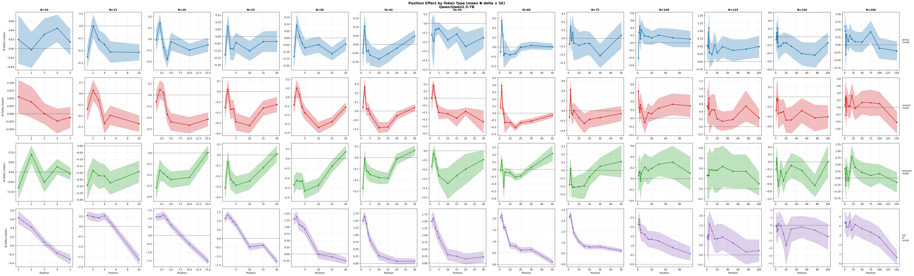
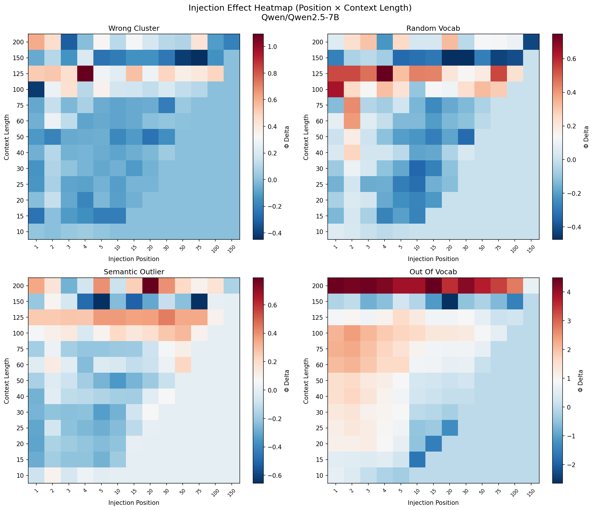
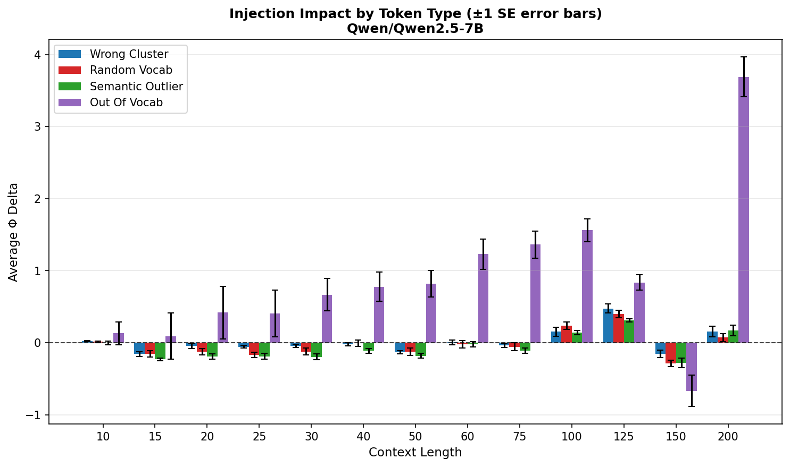

# Experiment: Incongruous Token Injection (500 Samples, Mean ± SE)

**Date**: 2026-01-22
**Model**: Qwen/Qwen2.5-7B (28 layers)
**W&B Run**: https://wandb.ai/thomasjiralerspong/icl-structural-influence/runs/q7zzcbka

## Objective

High-powered replication of the incongruous injection experiment with 500 samples per context length and mean ± standard error statistics (replacing median/IQR from previous runs).

## Configuration

- **Context lengths**: 10, 15, 20, 25, 30, 40, 50, 60, 75, 100, 125, 150, 200 (13 values)
- **N samples**: 500 per context length (6500 total iterations)
- **Layers tested**: [0, 4, 8, 12, 16, 20, 24, 27]
- **Token types**: wrong_cluster, random_vocab, semantic_outlier, out_of_vocab
- **Position granularity**: Fine early (1,2,3,4,5), then 10,15,20,30,50,75,100,150
- **Statistics**: Mean ± SE (standard error = std / sqrt(n))
- **Runtime**: ~2h 47min

## Key Results

- **Most disruptive token type**: `out_of_vocab` (median |Φ delta| = 1.65)
- **Wrong cluster tokens**: Early injection less disruptive (0.033) than late (0.226) - ratio 0.15
- **Semantic outliers**: Early median |Φ Δ| = 0.38, Late = 0.29 - ratio 1.30
- **Pattern**: Late injection consistently more disruptive for wrong_cluster; semantic_outlier shows opposite pattern

## Figures

### Position Effect by Token Type

Shows how the structural impact (mean Φ delta ± SE) varies by injection position for each context length. Early positions (1-5) have fine granularity.

### Position vs Context Length Heatmap

2D view of injection effects across position (x-axis) and context length (y-axis) for each token type.

### Layer Sensitivity Analysis

Left: Early vs late injection effects by layer. Right: Model surprise (loss) at incongruous tokens by position.

### Token Type Comparison

Average Φ delta by token type across context lengths.

## Raw Data

- Results JSON: `results/incongruous_injection_500samples/injection_results_Qwen_Qwen2.5-7B.json`

## Notes

- Uses bounded Φ metric (eps=1e-3) to prevent extreme ratio values
- Upgraded from 30 samples (previous experiment) to 500 samples for tighter confidence intervals
- Changed statistics from median/IQR to mean/SE as requested
- Fine context length granularity (step ~10-25) helps identify phase transition regions
- Early positions (1-5) tested at every position for detailed early-context analysis
