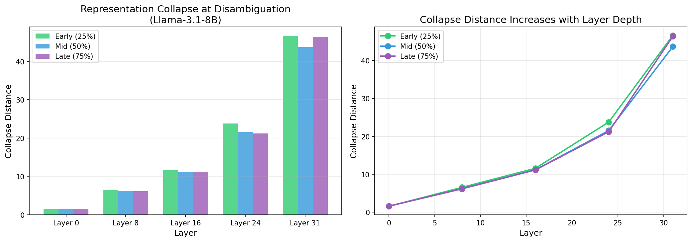
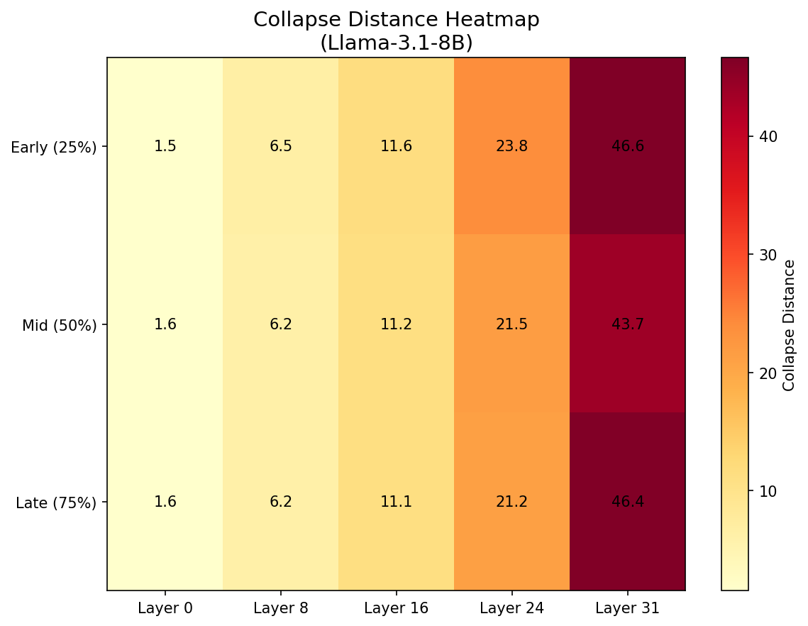

# Experiment: Hypothesis Superposition & Collapse

**Date**: 2026-01-22
**Model**: meta-llama/Llama-3.1-8B
**Results**: `results/superposition_collapse_llama31_v2/`

## Objective

Test whether LLMs maintain two competing interpretations in "superposition" until a disambiguating token forces representation collapse to one interpretation.

## Configuration

- **Context length**: 100 tokens
- **N trials**: 50 per condition
- **Layers tested**: 0, 8, 16, 24, 31
- **Conditions**:
  - Early reveal (25% through context)
  - Mid reveal (50%)
  - Late reveal (75%)
  - No reveal (control)
- **Graph**: 15 tokens, 3 clusters per interpretation, 60% clustering agreement between H1/H2

## Key Results

- **Collapse distance increases ~30x with layer depth** (1.5 at layer 0 → 46.6 at layer 31)
- **Early disambiguation shows slightly larger collapse** in deeper layers
- **Control condition shows no collapse** (as expected - no disambiguation point)
- **Pattern consistent across all layers tested**

| Layer | Early (25%) | Mid (50%) | Late (75%) | Control |
|-------|-------------|-----------|------------|---------|
| 0     | 1.54        | 1.56      | 1.58       | 0.00    |
| 8     | 6.54        | 6.24      | 6.15       | 0.00    |
| 16    | 11.56       | 11.17     | 11.14      | 0.00    |
| 24    | 23.76       | 21.52     | 21.22      | 0.00    |
| 31    | 46.63       | 43.68     | 46.39      | 0.00    |

## Figures

### Collapse Distance by Layer

Shows bar chart and line plot of collapse distance across layers and conditions. Clear exponential-like increase with layer depth.

### Collapse Distance Heatmap

Heatmap visualization showing collapse magnitude. Darker colors indicate larger representation shifts at disambiguation.

### Graph Structure

The dual interpretation graph used in the experiment, showing the two possible clusterings (H1 and H2).

## Raw Data

- Results JSON: `results/superposition_collapse_llama31_v2/results.json`
- Trial data: `results/superposition_collapse_llama31_v2/trials_layer*_*.json`

## Interpretation

1. **Deeper layers show larger collapse**: This suggests deeper layers develop more refined/abstract representations that are more sensitive to disambiguation. Early layers may encode more local/syntactic features that don't change as much.

2. **Early vs Late reveal**: Early disambiguation (25%) shows marginally larger collapse than late (75%), possibly because:
   - More context has accumulated under the "wrong" hypothesis by late reveal
   - Or the model commits more strongly to one interpretation over time

3. **Supports superposition hypothesis**: The existence of measurable collapse at disambiguation points supports the idea that models maintain multiple interpretations simultaneously during ambiguous contexts.

## Notes

- Fixed bfloat16 → float32 conversion issue in `src/metrics/superposition_metrics.py`
- The "collapse distance" metric measures representation movement at the disambiguation token
- Future work: Measure superposition score (distance from midpoint between H1/H2 centroids) before/after disambiguation
