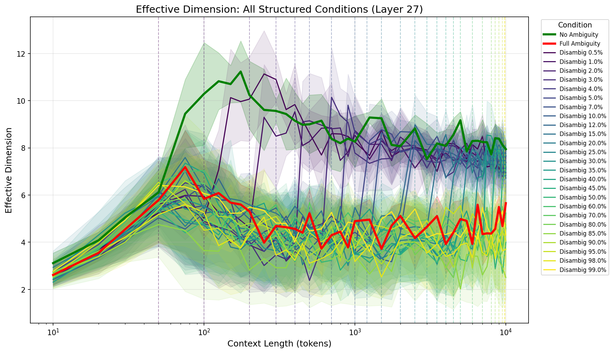
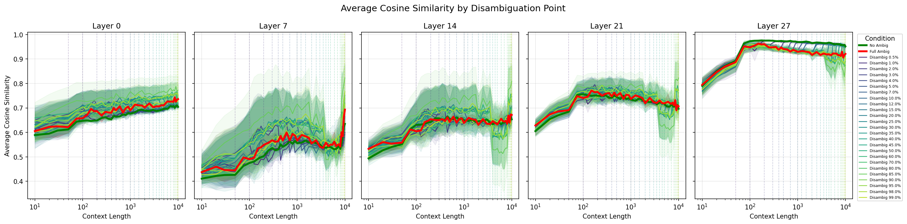
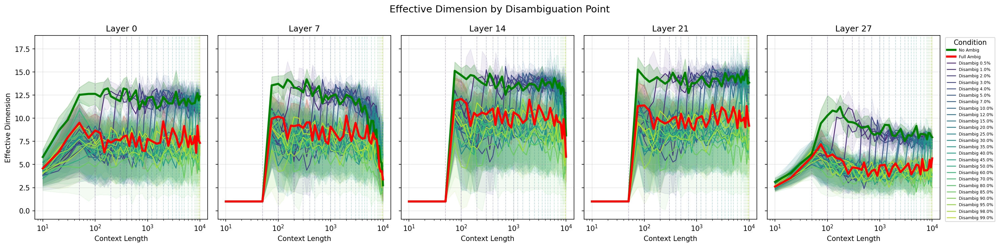
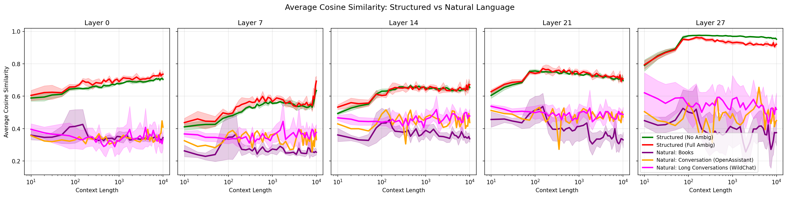

# Experiment: Representational Collapse Over Context Length

**Date**: 2026-02-09
**Model**: Qwen/Qwen2.5-7B
**Repository**: [icl-structural-influence](https://github.com/superkaiba/icl-structural-influence)

## Objective

Investigate how token representations "collapse" (converge to similar points) as context length increases, comparing:
1. Structured graph walks with varying disambiguation timing
2. Natural language contexts (books, conversations, Wikipedia)
3. Different vocabulary sizes (token diversity)

## Background

**Representational collapse** refers to the phenomenon where token representations become increasingly similar as context grows. This may relate to:
- "Context rot" - degradation of effective context utilization in long sequences
- Anisotropy - tendency of LLM representations to cluster in narrow cones
- Information bottlenecks in transformer architectures

## Collapse Metrics

For each checkpoint, we compute metrics over a sliding window of the last 50 token representations:

| Metric | Formula | Collapse Direction |
|--------|---------|-------------------|
| **Avg Cosine Similarity** | Mean pairwise cos(rep_i, rep_j) | Higher (→1.0) = collapsed |
| **Spread (Total Variance)** | trace(Cov(representations)) | Lower (→0) = collapsed |
| **Effective Dimension** | (Σλ)² / Σλ² (participation ratio) | Lower = collapsed |
| **Intrinsic Dimension** | Two-NN estimator | Lower = collapsed |

## Experimental Conditions

### Structured Graph Walks (34 conditions)
Using dual-interpretation graphs where walks can be valid under hypothesis H1, H2, or both:

- **No Ambiguity**: H1-only walk from start (baseline - no competing interpretation)
- **Full Ambiguity**: Both H1 and H2 valid throughout (never disambiguated)
- **Disambiguation at X%**: Ambiguous until X% of context, then H1-only
  - 25 disambiguation points: 0.5%, 1%, 2%, 3%, 4%, 5%, 7%, 10%, 12%, 15%, 20%, 25%, 30%, 35%, 40%, 45%, 50%, 60%, 70%, 80%, 85%, 90%, 95%, 98%, 99%

### Vocabulary Size Variants (4 conditions)
Same structure with different token diversity:
- vocab_15 (minimal), vocab_50, vocab_200, vocab_1000

### Natural Language (4 conditions)
- **Books**: Project Gutenberg (Pride and Prejudice, Alice in Wonderland, etc.)
- **Conversation (OpenAssistant)**: Many short conversations concatenated
- **Conversation (WildChat)**: Long single-user conversations (10+ turns)
- **Wikipedia**: WikiText-103 articles

## Configuration

```
Model: Qwen/Qwen2.5-7B (bfloat16)
Context length: 10,000 tokens
Checkpoints: 41 points (10, 20, 30, 50, 75, 100, ... 10000)
Window size: 50 tokens
Layers analyzed: 0, 7, 14, 21, 27
Trials per condition: 5
Total trials: 175
```

## Key Results

### 1. Universal Collapse Pattern
All conditions show representational collapse over context:
- Cosine similarity increases from ~0.4 to ~0.95
- Effective dimension decreases from ~30 to ~5-10
- Effect is strongest in later layers (21, 27)

### 2. Ambiguity Affects Collapse Trajectory
- **No Ambiguity** (green) shows distinct collapse pattern
- **Full Ambiguity** (red) maintains slightly different trajectory
- Disambiguation conditions interpolate between these baselines

### 3. Layer-Dependent Effects
- Layer 0: Minimal collapse, all conditions similar
- Middle layers (7, 14): Increasing differentiation
- Final layers (21, 27): Strongest collapse, clearest condition separation

### 4. Natural Language Shows High Variance
- Natural language conditions show more variance than structured walks
- WildChat (long conversations) behaves similarly to OpenAssistant (short concatenated)
- Books show highest variance in effective dimension

### 5. Vocabulary Size Has Minimal Effect
- Larger vocabulary (1000 tokens) doesn't dramatically slow collapse
- All vocab sizes converge to similar final collapse state

## Figures

### Single Layer (Layer 27) - All Structured Conditions

*Average cosine similarity increases (collapse) across all conditions. Green=No Ambig, Red=Full Ambig, Viridis=Disambiguation points.*


*Effective dimension decreases (collapse) over context. Vertical lines mark disambiguation points.*

### All Layers Comparison

*Collapse progresses through layers, strongest effect in final layers.*


*Effective dimension shows layer-dependent collapse patterns.*

### Data Type Comparison

*Natural language (purple, orange, magenta) shows higher variance than structured walks.*

## Raw Data

- Config: `results/collapse_10k_experiment/config.json`
- Results summary: `results/collapse_10k_experiment/results.json`
- Per-trial data: `results/collapse_10k_experiment/raw/*.json`
- WildChat standalone: `results/collapse_wildchat_experiment/`

## Code

- Experiment script: `experiments/core/run_collapse_over_context_experiment.py`
- Collapse metrics: `src/metrics/collapse_metrics.py`
- Natural language loader: `src/data/natural_language_loader.py`
- Plotting scripts: `experiments/plotting/plot_collapse_*.py`

## Conclusions

1. **Representational collapse is universal** - occurs regardless of content structure
2. **Disambiguation timing matters** - affects trajectory but not final collapse state
3. **Layer depth amplifies collapse** - final layers show strongest effects
4. **Natural language behaves similarly** - validates findings beyond synthetic data
5. **Token diversity has limited effect** - vocabulary size doesn't prevent collapse

## Open Questions

1. Does collapse correlate with task performance degradation?
2. Can collapse be reversed with contradicting information?
3. What is the relationship between collapse and "context rot"?
4. Do different model architectures show different collapse patterns?

## Related Literature

- Anisotropy in neural language models (Ethayarajh 2019)
- "Anisotropy Is Inherent to Self-Attention" (arXiv:2406.12143)
- "The Shape of Learning" (arXiv:2410.00443)
- Model collapse in training (Nature 2024)

---

*Generated from experiments run on 2026-02-09*
