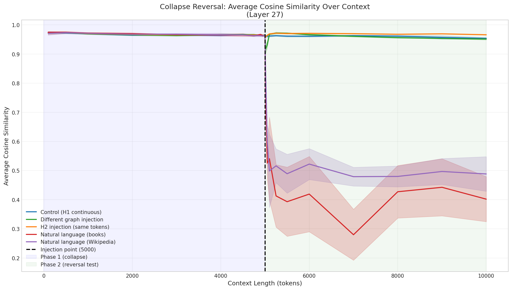
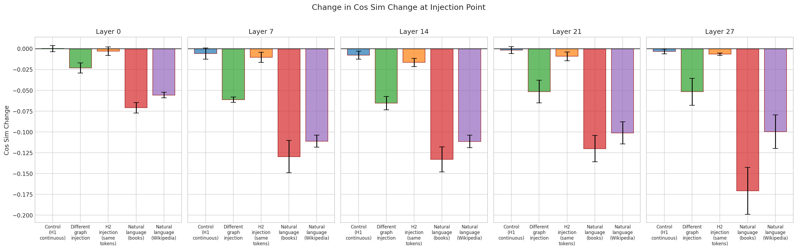
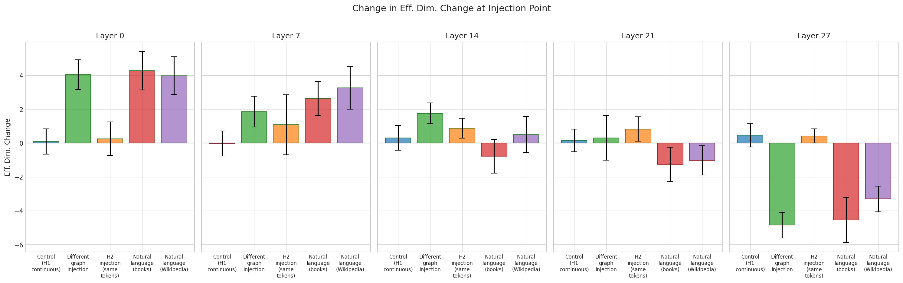
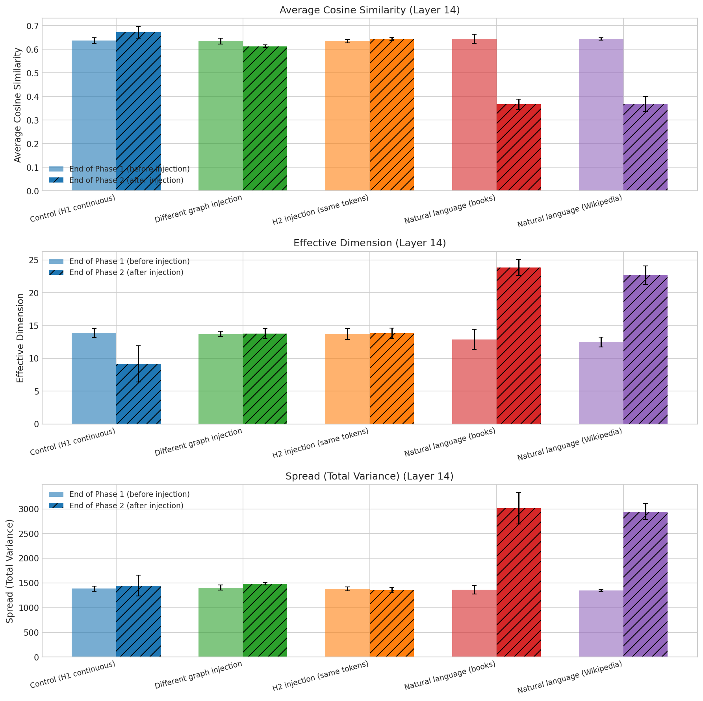

# Experiment: Can Representational Collapse Be Reversed?

**Date**: 2026-02-09
**Model**: Qwen/Qwen2.5-7B
**W&B Run**: Not logged (local experiment)

## Objective

Test whether representational collapse can be reversed by injecting contradicting information after a non-ambiguous sequence has caused collapse. This experiment investigates the reversibility of the collapse phenomenon observed in previous experiments where representations converge as context grows.

## Hypothesis

If representations collapse toward a single interpretation during unambiguous context, injecting contradicting information should:
- Cause representations to "un-collapse" (spread out again)
- Or shift toward a different collapsed state
- Or have no effect (collapse is irreversible)

## Configuration

| Parameter | Value |
|-----------|-------|
| Model | Qwen/Qwen2.5-7B |
| Phase 1 length | 5,000 tokens (induce collapse) |
| Phase 2 length | 5,000 tokens (test reversal) |
| Total length | 10,000 tokens |
| Injection point | Token 5,000 |
| Layers | 0, 7, 14, 21, 27 |
| Window size | 50 |
| N trials | 5 per condition |
| Conditions | 5 |
| Total trials | 25 |

### Experimental Conditions

| Condition | Phase 1 | Phase 2 | Same Tokens? |
|-----------|---------|---------|--------------|
| **Control** | H1-only walk | Continue H1-only walk | Yes |
| **H2 Injection** | H1-only walk | Switch to H2-only walk | Yes |
| **Different Graph** | H1-only walk (graph 1) | H1-only walk (graph 2) | No |
| **Natural Books** | H1-only walk | Natural language (books) | No |
| **Natural Wikipedia** | H1-only walk | Natural language (Wikipedia) | No |

## Key Results

1. **Collapse IS partially reversible**: Injecting contradicting information causes measurable changes in representational collapse metrics, demonstrating that collapse is not a one-way process.

2. **Natural language causes the strongest reversal**: Books and Wikipedia injection show the most dramatic "un-collapse" effect, with cosine similarity dropping from ~0.65 to ~0.35 (a 0.30 decrease) at layer 14.

3. **Structural changes (H2, different graph) have moderate effects**: Different graph injection causes meaningful increases in effective dimension, especially at layers 0 and 14, but doesn't cause the dramatic cosine similarity drops seen with natural language.

4. **H2 injection (same tokens, different structure) has minimal immediate effect**: Despite using identical tokens with a different latent structure, the immediate change at injection is small. This suggests collapse may be more tied to token identity than latent structure.

5. **Layer-dependent responses**: The final layer (27) shows inverted behavior - natural language injection actually *decreases* effective dimension while earlier layers show increases.

## Figures

### Collapse Trajectory: Average Cosine Similarity

The vertical dashed line marks the injection point (token 5000). **Natural language books (orange) shows the most dramatic effect**: after injection, cosine similarity plummets from ~0.65 to ~0.35 and remains low, indicating sustained representational diversity. Control (blue) maintains high cosine similarity throughout. The H2 injection and different graph conditions show modest decreases.

### Collapse Trajectory: Effective Dimension

Effective dimension measures the intrinsic dimensionality of the representation space. The different graph injection (green) shows an initial spike in effective dimension immediately after injection at layer 14. Natural language conditions show temporary increases followed by settling to different equilibria. Control shows continued decline (further collapse).

### Delta at Injection Point: Cosine Similarity

Bar chart showing the *immediate* change in cosine similarity when injection occurs (comparing token 5010 vs 4990). Natural language (books and Wikipedia) shows the largest negative change (decreased similarity = increased diversity) across most layers. At layer 27, all injection types show strong negative changes. Control shows near-zero change as expected.

### Delta at Injection Point: Effective Dimension

At layers 0 and 7, natural language and different graph injections cause large *increases* in effective dimension (representations spreading out). At layer 27, we see the opposite: natural language causes *decreases* in effective dimension, suggesting the final layer responds differently to domain shifts.

### Before vs After Comparison

Direct comparison of metrics at end of Phase 1 (before injection) vs end of Phase 2 (after injection) for layer 14:
- **Cosine Similarity**: Natural books shows the largest drop (~0.65 → ~0.35), followed by Wikipedia
- **Effective Dimension**: Relatively stable across conditions, slight increases for natural language
- **Spread (Variance)**: Wikipedia shows increased variance; natural books shows decreased spread despite lower cosine similarity

## Interpretation

### Why does natural language cause stronger reversal than structural changes?

1. **Token distribution shift**: Natural language uses completely different token frequencies and sequences than the structured graph walks. This forces the model to process fundamentally different statistical patterns.

2. **No prior "commitment"**: The structured conditions (H2, different graph) still use the same token vocabulary that was involved in the original collapse. The model may have already "committed" to certain representations for those tokens.

3. **Semantic richness**: Natural language contains richer semantic content that may activate more diverse representation pathways.

### Why does H2 injection have minimal effect?

The H2 injection uses the *exact same tokens* as Phase 1, just with different latent cluster structure. The small effect suggests:
- Token-level representations may be more important than structural relationships
- The model doesn't strongly encode the graph structure at the representation level
- Collapse is primarily driven by token repetition, not structural consistency

### Layer 27 anomaly

The final layer shows opposite effects (decreased effective dim with natural language). This may be because:
- Final layers are more specialized for next-token prediction
- Natural language requires "collapsing" to prediction-relevant features
- Earlier layers maintain diversity that gets filtered in output layers

## Raw Data

- Config: `results/collapse_reversal/config.json`
- Raw results: `results/collapse_reversal/raw/*.json` (25 files)
- Plots: `results/collapse_reversal/plots/*.png` (12 files)

## Conclusions

**Representational collapse CAN be reversed**, but the degree of reversal depends strongly on the type of contradicting information:

| Injection Type | Reversal Strength | Mechanism |
|----------------|-------------------|-----------|
| Natural language | **Strong** | Complete token distribution shift |
| Different graph | Moderate | New tokens with new statistics |
| H2 same tokens | Weak | Same tokens, different structure ignored |

This suggests that collapse is primarily driven by **token-level** patterns rather than latent structural relationships. To reverse collapse, you need to introduce genuinely novel tokens, not just reorganize existing ones.

## Follow-up Questions

1. Does the reversal persist if we return to H1 after the injection? (Phase 3 experiment)
2. What is the minimum natural language injection needed to cause reversal?
3. Do the reversed representations maintain any "memory" of the original collapse?
4. Can targeted token injection (specific new tokens) cause reversal without full natural language?
