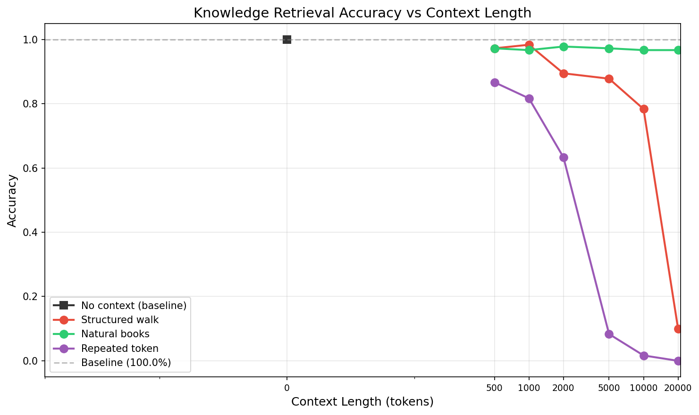
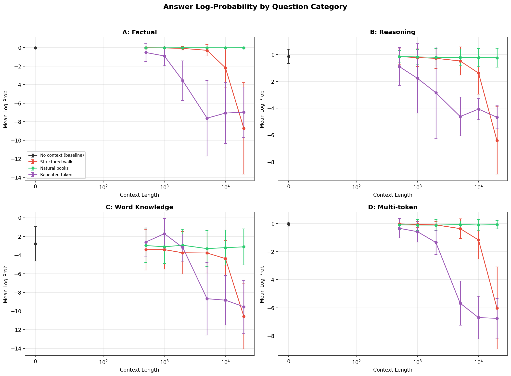
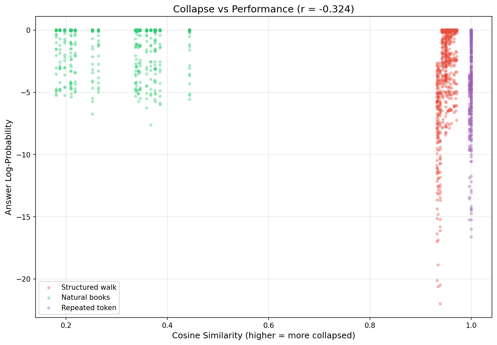
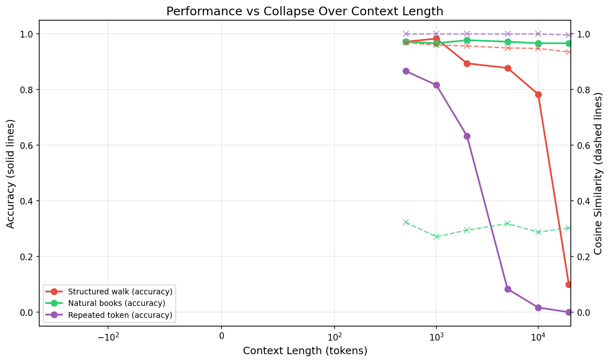
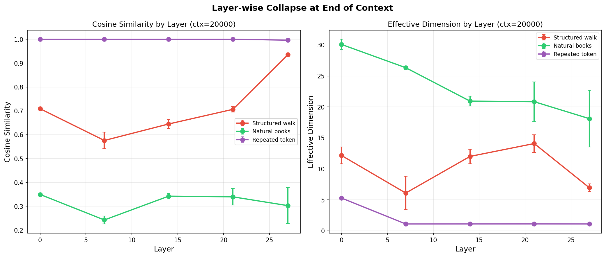
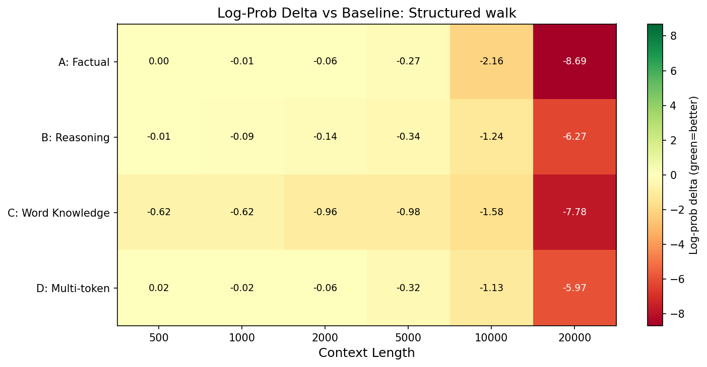
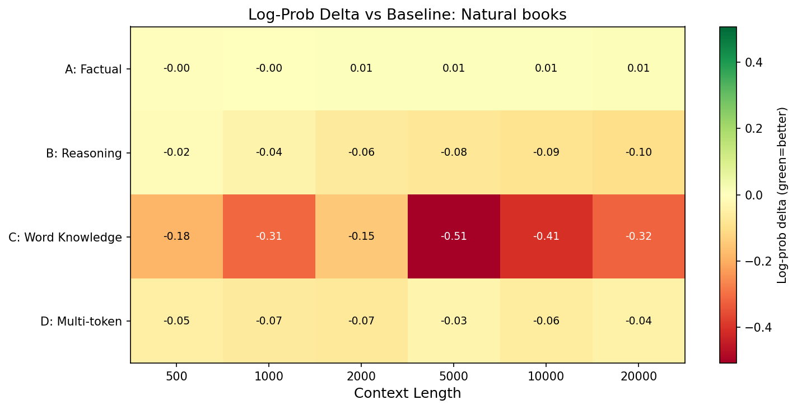
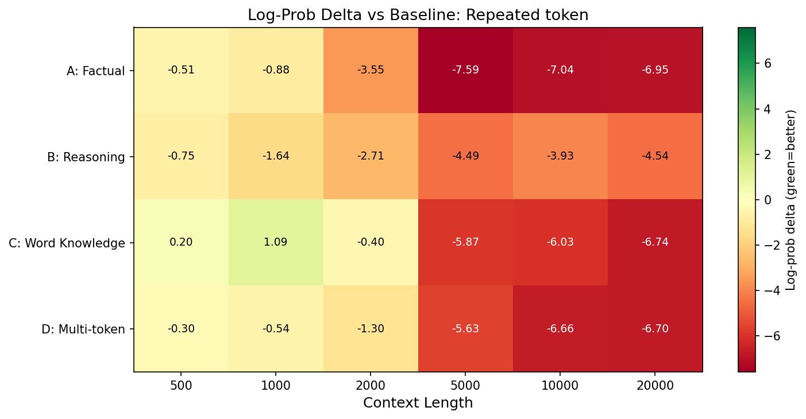

# Experiment: Does Representational Collapse Impair Knowledge Retrieval?

**Date**: 2026-02-13 (run), 2026-02-17 (writeup)
**Model**: Qwen/Qwen2.5-7B-Instruct (28 layers, hidden_dim=3584)

## Objective

Our 32K collapse experiment established that representational collapse is **content-dependent**: structured graph walks cause early/mid layer representations to converge (effective dimension 14 → 1), while natural language context does not collapse. This experiment tests whether that geometric collapse has **functional consequences** -- can the model still retrieve parametric knowledge after collapse-inducing context fills the KV cache?

## Motivation

Representational collapse (high cosine similarity, low effective dimension among token representations) is a geometric observation. But geometry alone doesn't tell us whether the model's computation is impaired. Two competing hypotheses:

1. **Collapse hurts retrieval**: If representations converge to a low-dimensional manifold, the model loses the ability to distinguish between different query types, degrading downstream performance.
2. **Collapse is epiphenomenal**: The model's computation relies on the full residual stream (not just the geometric structure of the last N tokens), so collapse in context representations doesn't impair query processing.

## Experimental Design

### Context Types (4)

| Type | Description | Expected Collapse |
|------|-------------|-------------------|
| `no_context` | Question only (baseline) | None |
| `structured_walk` | Random walks on stochastic block model graphs (50 node vocabulary, structured transitions) | High (cos_sim ~0.95) |
| `natural_books` | Excerpts from Project Gutenberg books (rich natural language) | Low (cos_sim ~0.30) |
| `repeated_token` | Single token repeated (extreme degenerate case) | Extreme (cos_sim ~1.0, eff_dim = 0) |

### Context Lengths (7)

0, 500, 1,000, 2,000, 5,000, 10,000, 20,000 tokens

### Questions (60 pre-screened from 80 candidates)

Questions span four categories of increasing complexity:

| Category | Passed Screening | Examples |
|----------|-----------------|----------|
| **A: Factual** | 18/20 | "What is the capital of Bhutan?" → Thimphu; "What is the atomic number of Osmium?" → 76 |
| **B: Reasoning** | 16/20 | "What is 17 times 23?" → 391; "What is 7 to the power of 4?" → 2401 |
| **C: Word Knowledge** | 11/20 | "What word means 'fear of heights'?" → Acrophobia; "What is the adjective form of 'parsimony'?" → Parsimonious |
| **D: Multi-token** | 15/20 | "Who proved Fermat's Last Theorem?" → Andrew Wiles; "Who directed Stalker and Solaris?" → Andrei Tarkovsky |

Pre-screening filters to questions the model answers correctly at baseline (100% accuracy at no_context). This ensures any degradation is attributable to context effects, not baseline model weakness.

### Metrics

- **`accuracy`**: Binary correctness via flexible string matching (substring, first-word, multi-word)
- **`answer_log_prob`**: Mean log-probability of correct answer tokens (continuous measure of confidence)
- **`collapse_cos_sim`**: Average pairwise cosine similarity of last 50 context token representations at layer 27
- **`collapse_eff_dim`**: Effective dimensionality (participation ratio of eigenvalue spectrum)
- **`collapse_spread`**: Frobenius norm of centered representation matrix
- **`correlation_collapse_vs_logprob`**: Pearson r between cos_sim and log-prob across all evaluations

### Trials

- 3 trials per (structured_walk, natural_books) × context_length, each with different random context
- 1 trial per repeated_token × context_length (deterministic)
- 1 trial for no_context baseline
- **Total**: 2,580 evaluations

### Implementation

Efficient KV cache reuse: process context once, then clone the KV cache for each of 60 questions. This avoids re-processing context 60 times per condition.

```
For each (context_type, context_length, trial):
  1. Generate context tokens
  2. Process in 512-token chunks via forward_incremental() → KV cache
  3. Compute collapse metrics on last 50 context representations
  4. For each question:
     a. Deep-copy KV cache
     b. Forward question tokens → measure log-prob of expected answer
     c. Greedy decode → check accuracy
```

## Configuration

```json
{
  "model": "Qwen/Qwen2.5-7B-Instruct",
  "layers": [0, 7, 14, 21, 27],
  "context_lengths": [0, 500, 1000, 2000, 5000, 10000, 20000],
  "context_types": ["no_context", "structured_walk", "natural_books", "repeated_token"],
  "n_trials": 3,
  "n_questions": 60,
  "use_chat_template": true,
  "chunk_size": 512
}
```

## Key Results

- **Structured walk context degrades accuracy from 97% (500 tokens) to 10% (20K tokens)**, with the sharpest drop between 10K and 20K
- **Natural books context maintains ~97% accuracy throughout**, even at 20,000 tokens
- **Repeated token (extreme collapse) degrades fastest**: 87% at 500 tokens → 0% at 20K tokens
- **Correlation between collapse (cos_sim) and log-prob: r = -0.324**, confirming that higher collapse predicts worse performance
- **All question categories degrade under collapse**, with reasoning (B) and multi-token (D) categories most sensitive

### Summary Table: Accuracy by Context Type and Length

| Context Length | No Context | Structured Walk | Natural Books | Repeated Token |
|---------------|------------|-----------------|---------------|----------------|
| 0 | 100% | — | — | — |
| 500 | — | 97.2% | 97.2% | 86.7% |
| 1,000 | — | 98.3% | 96.7% | 81.7% |
| 2,000 | — | 89.4% | 97.8% | 63.3% |
| 5,000 | — | 87.8% | 97.2% | 8.3% |
| 10,000 | — | 78.3% | 96.7% | 1.7% |
| 20,000 | — | 10.0% | 96.7% | 0.0% |

### Collapse Metrics

| Context Type | cos_sim (L27) | eff_dim (L27) | spread |
|-------------|--------------|---------------|---------|
| Structured walk (20K) | 0.935 | 6.96 | 26,785 |
| Natural books (20K) | 0.303 | 18.1 | 205,744 |
| Repeated token (20K) | 0.996 | 1.1 | 4,131 |

## Figures

### Accuracy vs Context Length


The headline result. Natural books (green) remains flat at ~97% across all context lengths. Structured walk (blue) shows progressive degradation, with a cliff between 10K and 20K tokens. Repeated token (red) degrades fastest, reaching 0% by 20K. This demonstrates that representational collapse has real functional consequences for knowledge retrieval.

### Log-Probability by Question Category


2x2 grid showing log-probability (continuous confidence measure) across all four question categories. Word knowledge (C) has the lowest baseline log-probs (model is less confident on vocabulary questions). All categories show degradation under structured walk, but reasoning (B) and multi-token (D) degrade most steeply.

### Collapse-Performance Scatter


Each point is one (context_type, context_length) condition. X-axis is cosine similarity (collapse severity), Y-axis is mean log-probability. Clear negative relationship: higher collapse → lower log-probs. Natural books cluster at low cos_sim / high log-prob; repeated token at extreme cos_sim / low log-prob; structured walk spans the middle range. Pearson r = -0.324.

### Dual-Axis: Collapse and Performance Over Context Length


Overlays collapse metrics (dashed lines) with accuracy (solid lines) on the same x-axis. Shows the temporal relationship: collapse precedes or co-occurs with performance degradation. For structured walk, cos_sim is already high at 500 tokens but accuracy doesn't drop until 2K+, suggesting the model has some resilience to moderate collapse.

### Layer-wise Collapse


Cosine similarity at each of the 5 monitored layers (0, 7, 14, 21, 27) across context lengths. Structured walk shows uniformly high collapse across all layers (>0.93). Natural books shows low collapse (~0.3) across all layers. Repeated token saturates at cos_sim ≈ 1.0 everywhere.

### Log-Probability Heatmaps

#### Structured Walk


Log-prob delta (relative to no-context baseline) by question category and context length. Deepening red indicates increasing degradation. All categories degrade at 20K, with word knowledge (C) and factual (A) showing the largest absolute drops.

#### Natural Books


Nearly flat across all conditions -- no meaningful degradation. Some categories even show slight improvement (green cells), suggesting natural language context can marginally help knowledge retrieval.

#### Repeated Token


Rapid degradation starting at 500 tokens. By 5K tokens, all categories show severe log-prob drops (>5 nats below baseline).

## Interpretation

### Collapse IS Functionally Harmful

This experiment conclusively shows that representational collapse is **not epiphenomenal** -- it has real consequences for the model's ability to retrieve parametric knowledge. The key evidence:

1. **Dissociation by content type**: The same model, same questions, same context lengths produce dramatically different outcomes depending on whether the context is collapse-inducing (structured walk) or not (natural books). This rules out simple "long context = bad" explanations.

2. **Dose-response relationship**: Performance degrades progressively with context length for collapse-inducing types, not just at a threshold. The correlation r = -0.324 across all evaluations confirms a graded relationship.

3. **Category sensitivity**: Reasoning and multi-token answers are most sensitive, suggesting collapse particularly impairs tasks requiring more complex token generation.

### Mechanism Hypothesis

The structured walk context fills the KV cache with representations that are geometrically similar (high cos_sim). When the model attends to these during question answering, the attention pattern becomes less discriminative -- all context tokens look similar, so the model can't effectively ignore the irrelevant context. This "attention flooding" degrades the model's ability to surface parametric knowledge.

### Resilience Window

An important nuance: the model shows some resilience at moderate collapse levels. At 500-1,000 tokens of structured walk context (cos_sim ~0.96, eff_dim ~8-10), accuracy remains >97%. The cliff comes at 10K-20K tokens. This suggests the attention mechanism can compensate for moderate KV cache homogeneity but breaks down at extreme levels.

## Raw Data

- Aggregated results: `results/probing_collapse_performance/results.json`
- Per-question results: `results/probing_collapse_performance/all_results.json`
- Config: `results/probing_collapse_performance/config.json`
- Plots: `results/probing_collapse_performance/plots/`

## Notes

- Word knowledge (C) had the lowest screening pass rate (11/20) because the model often gave correct synonyms that didn't match the expected answer string. This is a limitation of exact-match evaluation.
- The repeated_token condition uses a single token (e.g., token ID 0) repeated, creating maximally degenerate representations. This is an extreme case not seen in practice but useful as an upper bound on collapse effects.
- Chat template formatting was used for all conditions (Qwen2.5-Instruct requires it), with context injected as a system message prefix.
- KV cache deep-copy handles both `DynamicCache` (transformers >= 4.36) and legacy tuple-of-tuples formats.
