# Experiment: Does Representational Collapse Impair Knowledge Retrieval?

**Date**: 2026-02-13 (run), 2026-02-17 (writeup)
**Model**: Qwen/Qwen2.5-7B-Instruct (28 layers, hidden_dim=3584)

## Objective

Our 32K collapse experiment established that representational collapse is **content-dependent**: structured graph walks cause early/mid layer representations to converge (effective dimension 14 → 1), while natural language context does not collapse. This experiment tests whether that geometric collapse has **functional consequences** -- can the model still retrieve parametric knowledge after collapse-inducing context fills the KV cache?

## Motivation

Representational collapse (high cosine similarity, low effective dimension among token representations) is a geometric observation. But geometry alone doesn't tell us whether the model's computation is impaired. Two competing hypotheses:

1. **Collapse hurts retrieval**: If representations converge to a low-dimensional manifold, the model loses the ability to distinguish between different query types, degrading downstream performance.
2. **Collapse is epiphenomenal**: The model's computation relies on the full residual stream (not just the geometric structure of the last N tokens), so collapse in context representations doesn't impair query processing.

## Experimental Design

### Context Types (4)

| Type | Description | Expected Collapse |
|------|-------------|-------------------|
| `no_context` | Question only (baseline) | None |
| `structured_walk` | Random walks on stochastic block model graphs (50 node vocabulary, structured transitions) | High (cos_sim ~0.95) |
| `natural_books` | Excerpts from Project Gutenberg books (rich natural language) | Low (cos_sim ~0.30) |
| `repeated_token` | Single token repeated (extreme degenerate case) | Extreme (cos_sim ~1.0, eff_dim = 0) |

### Context Lengths (7)

0, 500, 1,000, 2,000, 5,000, 10,000, 20,000 tokens

### Questions (60 pre-screened from 80 candidates)

Questions span four categories of increasing complexity:

| Category | Passed Screening | Examples |
|----------|-----------------|----------|
| **A: Factual** | 18/20 | "What is the capital of Bhutan?" → Thimphu; "What is the atomic number of Osmium?" → 76 |
| **B: Reasoning** | 16/20 | "What is 17 times 23?" → 391; "What is 7 to the power of 4?" → 2401 |
| **C: Word Knowledge** | 11/20 | "What word means 'fear of heights'?" → Acrophobia; "What is the adjective form of 'parsimony'?" → Parsimonious |
| **D: Multi-token** | 15/20 | "Who proved Fermat's Last Theorem?" → Andrew Wiles; "Who directed Stalker and Solaris?" → Andrei Tarkovsky |

Pre-screening filters to questions the model answers correctly at baseline (100% accuracy at no_context). This ensures any degradation is attributable to context effects, not baseline model weakness.

### Metrics

- **`accuracy`**: Binary correctness via flexible string matching (substring, first-word, multi-word)
- **`answer_log_prob`**: Mean log-probability of correct answer tokens (continuous measure of confidence)
- **`collapse_cos_sim`**: Average pairwise cosine similarity of last 50 context token representations at layer 27
- **`collapse_eff_dim`**: Effective dimensionality (participation ratio of eigenvalue spectrum)
- **`collapse_spread`**: Frobenius norm of centered representation matrix
- **`correlation_collapse_vs_logprob`**: Pearson r between cos_sim and log-prob across all evaluations

### Trials

- 3 trials per (structured_walk, natural_books) × context_length, each with different random context
- 1 trial per repeated_token × context_length (deterministic)
- 1 trial for no_context baseline
- **Total**: 2,580 evaluations

### Implementation

Efficient KV cache reuse: process context once, then clone the KV cache for each of 60 questions. This avoids re-processing context 60 times per condition.

```
For each (context_type, context_length, trial):
  1. Generate context tokens
  2. Process in 512-token chunks via forward_incremental() → KV cache
  3. Compute collapse metrics on last 50 context representations
  4. For each question:
     a. Deep-copy KV cache
     b. Forward question tokens → measure log-prob of expected answer
     c. Greedy decode → check accuracy
```

## Configuration

```json
{
  "model": "Qwen/Qwen2.5-7B-Instruct",
  "layers": [0, 7, 14, 21, 27],
  "context_lengths": [0, 500, 1000, 2000, 5000, 10000, 20000],
  "context_types": ["no_context", "structured_walk", "natural_books", "repeated_token"],
  "n_trials": 3,
  "n_questions": 60,
  "use_chat_template": true,
  "chunk_size": 512
}
```

## Key Results

- **Structured walk context degrades accuracy from 97% (500 tokens) to 10% (20K tokens)**, with the sharpest drop between 10K and 20K
- **Natural books context maintains ~97% accuracy throughout**, even at 20,000 tokens
- **Repeated token (extreme collapse) degrades fastest**: 87% at 500 tokens → 0% at 20K tokens
- **Correlation between collapse (cos_sim) and log-prob: r = -0.324**, confirming that higher collapse predicts worse performance
- **All question categories degrade under collapse**, with reasoning (B) and multi-token (D) categories most sensitive

### Summary Table: Accuracy by Context Type and Length

| Context Length | No Context | Structured Walk | Natural Books | Repeated Token |
|---------------|------------|-----------------|---------------|----------------|
| 0 | 100% | — | — | — |
| 500 | — | 97.2% | 97.2% | 86.7% |
| 1,000 | — | 98.3% | 96.7% | 81.7% |
| 2,000 | — | 89.4% | 97.8% | 63.3% |
| 5,000 | — | 87.8% | 97.2% | 8.3% |
| 10,000 | — | 78.3% | 96.7% | 1.7% |
| 20,000 | — | 10.0% | 96.7% | 0.0% |

### Collapse Metrics

| Context Type | cos_sim (L27) | eff_dim (L27) | spread |
|-------------|--------------|---------------|---------|
| Structured walk (20K) | 0.935 | 6.96 | 26,785 |
| Natural books (20K) | 0.303 | 18.1 | 205,744 |
| Repeated token (20K) | 0.996 | 1.1 | 4,131 |

## Figures

### Accuracy vs Context Length


The headline result. Natural books (green) remains flat at ~97% across all context lengths. Structured walk (blue) shows progressive degradation, with a cliff between 10K and 20K tokens. Repeated token (red) degrades fastest, reaching 0% by 20K. This demonstrates that representational collapse has real functional consequences for knowledge retrieval.

### Log-Probability by Question Category


2x2 grid showing log-probability (continuous confidence measure) across all four question categories. Word knowledge (C) has the lowest baseline log-probs (model is less confident on vocabulary questions). All categories show degradation under structured walk, but reasoning (B) and multi-token (D) degrade most steeply.

### Collapse-Performance Scatter


Each point is one (context_type, context_length) condition. X-axis is cosine similarity (collapse severity), Y-axis is mean log-probability. Clear negative relationship: higher collapse → lower log-probs. Natural books cluster at low cos_sim / high log-prob; repeated token at extreme cos_sim / low log-prob; structured walk spans the middle range. Pearson r = -0.324.

### Dual-Axis: Collapse and Performance Over Context Length


Overlays collapse metrics (dashed lines) with accuracy (solid lines) on the same x-axis. Shows the temporal relationship: collapse precedes or co-occurs with performance degradation. For structured walk, cos_sim is already high at 500 tokens but accuracy doesn't drop until 2K+, suggesting the model has some resilience to moderate collapse.

### Layer-wise Collapse


Cosine similarity at each of the 5 monitored layers (0, 7, 14, 21, 27) across context lengths. Structured walk shows uniformly high collapse across all layers (>0.93). Natural books shows low collapse (~0.3) across all layers. Repeated token saturates at cos_sim ≈ 1.0 everywhere.

### Log-Probability Heatmaps

#### Structured Walk


Log-prob delta (relative to no-context baseline) by question category and context length. Deepening red indicates increasing degradation. All categories degrade at 20K, with word knowledge (C) and factual (A) showing the largest absolute drops.

#### Natural Books


Nearly flat across all conditions -- no meaningful degradation. Some categories even show slight improvement (green cells), suggesting natural language context can marginally help knowledge retrieval.

#### Repeated Token


Rapid degradation starting at 500 tokens. By 5K tokens, all categories show severe log-prob drops (>5 nats below baseline).

## Interpretation

### Collapse IS Functionally Harmful

This experiment conclusively shows that representational collapse is **not epiphenomenal** -- it has real consequences for the model's ability to retrieve parametric knowledge. The key evidence:

1. **Dissociation by content type**: The same model, same questions, same context lengths produce dramatically different outcomes depending on whether the context is collapse-inducing (structured walk) or not (natural books). This rules out simple "long context = bad" explanations.

2. **Dose-response relationship**: Performance degrades progressively with context length for collapse-inducing types, not just at a threshold. The correlation r = -0.324 across all evaluations confirms a graded relationship.

3. **Category sensitivity**: Reasoning and multi-token answers are most sensitive, suggesting collapse particularly impairs tasks requiring more complex token generation.

### Mechanism Hypothesis

The structured walk context fills the KV cache with representations that are geometrically similar (high cos_sim). When the model attends to these during question answering, the attention pattern becomes less discriminative -- all context tokens look similar, so the model can't effectively ignore the irrelevant context. This "attention flooding" degrades the model's ability to surface parametric knowledge.

### Resilience Window

An important nuance: the model shows some resilience at moderate collapse levels. At 500-1,000 tokens of structured walk context (cos_sim ~0.96, eff_dim ~8-10), accuracy remains >97%. The cliff comes at 10K-20K tokens. This suggests the attention mechanism can compensate for moderate KV cache homogeneity but breaks down at extreme levels.

---

## Follow-up: Can an Ignore Instruction Mitigate Collapse?

**Date**: 2026-02-17

### Motivation

If collapse impairs knowledge retrieval by flooding the attention mechanism with homogeneous KV entries, can we mitigate this by explicitly telling the model to ignore the preceding context? This tests whether the degradation is a soft attention problem (fixable with instructions) or a hard representation problem (the KV cache is too corrupted to recover from).

### Design

After processing the collapse-inducing context into the KV cache, we inject 23 tokens:

> "Ignore all of the preceding text. It is irrelevant filler. Answer the following question using only your own knowledge."

The sequence becomes: `[context tokens] [ignore instruction] [question]`

We test `structured_walk_ignore` and `repeated_token_ignore` at context lengths 2K, 5K, 10K, and 20K.

### Results: Accuracy Comparison

| Context Length | Structured Walk | + Ignore | Delta | Repeated Token | + Ignore | Delta |
|---------------|-----------------|----------|-------|----------------|----------|-------|
| 2,000 | 89.4% | 97.8% | **+8.4** | 63.3% | 73.3% | **+10.0** |
| 5,000 | 87.8% | 93.3% | **+5.5** | 8.3% | 55.0% | **+46.7** |
| 10,000 | 78.3% | 80.0% | **+1.7** | 1.7% | 3.3% | **+1.6** |
| 20,000 | 10.0% | 2.2% | **-7.8** | 0.0% | 0.0% | **0.0** |

### Figures

#### Accuracy: Original vs Ignore Instruction
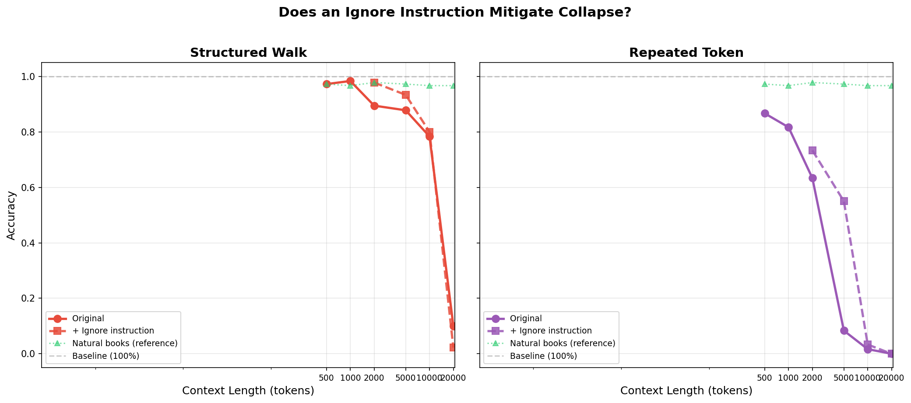

Side-by-side comparison for structured walk (left) and repeated token (right). Dashed lines show the ignore-instruction variant. The ignore instruction provides a clear boost at moderate context lengths but cannot overcome extreme collapse at 20K.

#### Accuracy Delta from Ignore Instruction
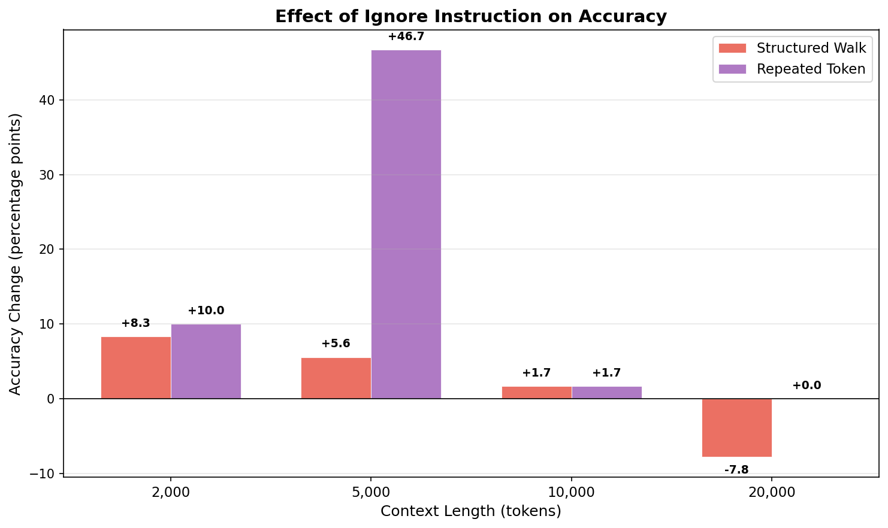

Bar chart showing the accuracy change (in percentage points) from adding the ignore instruction. The most dramatic effect is repeated token at 5K tokens: +46.7 percentage points. At 20K, the effect is zero or slightly negative.

#### Log-Probability: Original vs Ignore Instruction
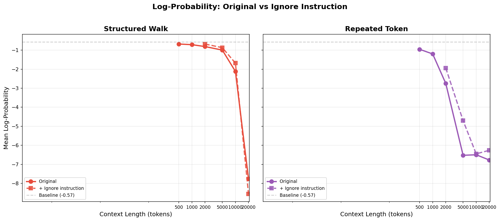

Log-probability (continuous confidence measure) tells the same story. At moderate lengths, the ignore instruction partially restores confidence. At 20K, log-probs remain catastrophically low regardless.

#### All Conditions Combined
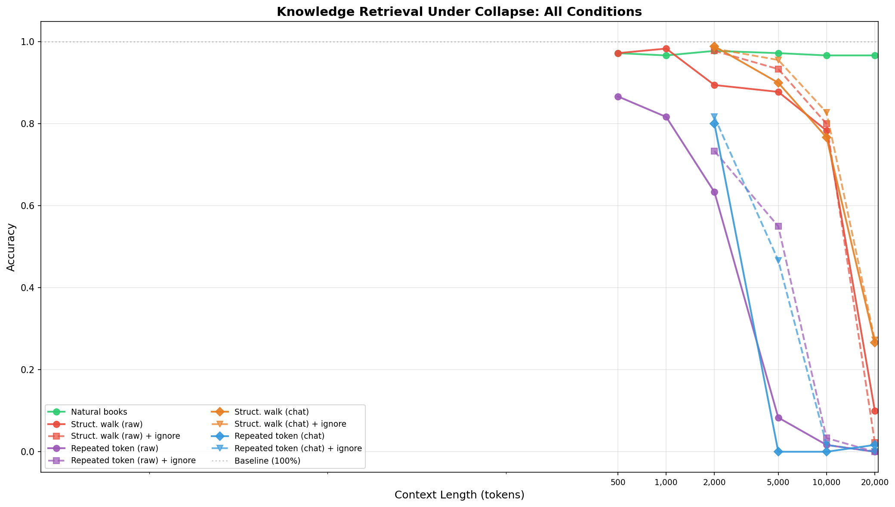

All 6 conditions on a single plot. Natural books (green) remains the gold standard at ~97% throughout. The ignore variants (dashed) sit between their original condition and natural books at moderate lengths, but converge to the same near-zero accuracy at 20K.

### Interpretation

The ignore instruction reveals two regimes:

1. **Moderate collapse (2K-5K tokens)**: The instruction helps substantially. The model can attend to the instruction tokens and partially downweight the collapsed KV entries. The +46.7% boost for repeated_token at 5K is particularly striking -- suggesting that at this length, the model *could* answer correctly if it could just ignore the noise, and the instruction helps it do so.

2. **Extreme collapse (10K-20K tokens)**: The instruction is ineffective or even counterproductive. At 20K structured walk tokens, accuracy drops from 10% to 2.2% with the ignore instruction. This suggests that at extreme lengths, the 23 instruction tokens are too few to overcome 20K homogeneous KV entries -- the attention mechanism is overwhelmed regardless of what the instruction says. The instruction may even "use up" some of the model's limited capacity to process non-collapsed tokens.

This supports the **attention flooding** hypothesis: collapsed KV entries don't just add noise, they dominate the attention distribution because they all have similar keys. A short instruction can partially reweight attention at moderate saturation, but at extreme levels the sheer volume of identical KV entries makes the instruction invisible to the attention mechanism.

---

## Follow-up 2: Does Chat Template Formatting Help?

**Date**: 2026-02-17

### Motivation

In the original experiment, collapse-inducing context was injected as **raw tokens** directly into the KV cache, bypassing the chat template entirely. The question was then presented in proper chat template format (ChatML for Qwen2.5-Instruct). This creates an unnatural input structure that the model was never trained on -- raw bytes followed by a formatted chat turn.

A natural question: does wrapping the collapse-inducing context in proper chat template format (as a user message) help the model compartmentalize it and answer questions better? The model was trained on multi-turn conversations, so it might handle irrelevant-but-formatted context better than raw injection.

### Design

We wrap the raw context tokens in a multi-turn chat template structure:

```
<|im_start|>user
[decoded raw context tokens]<|im_end|>
<|im_start|>assistant
OK.<|im_end|>
<|im_start|>user
Answer in as few words as possible.

Q: [question]
A:<|im_end|>
<|im_start|>assistant
```

For `_chat_ignore` variants, we add an additional turn before the question:

```
<|im_start|>user
Ignore everything in the previous message. It was irrelevant filler text.
Answer the following question using only your own knowledge.<|im_end|>
<|im_start|>assistant
Understood, I will ignore that text and answer based only on my knowledge.<|im_end|>
```

Four new conditions tested at 2K, 5K, 10K, and 20K tokens:
- `structured_walk_chat`: structured walk context wrapped in chat template
- `structured_walk_chat_ignore`: chat-wrapped + explicit ignore turn
- `repeated_token_chat`: repeated token in chat template
- `repeated_token_chat_ignore`: chat-wrapped repeated token + ignore turn

### Results: Accuracy Comparison

#### Structured Walk

| Context Length | Raw Injection | Raw + Ignore | Chat Template | Chat + Ignore |
|---------------|--------------|--------------|---------------|---------------|
| 2,000 | 89.4% | 97.8% | **98.9%** | 98.3% |
| 5,000 | 87.8% | 93.3% | 90.0% | **95.6%** |
| 10,000 | 78.3% | 80.0% | 76.7% | **82.8%** |
| 20,000 | 10.0% | 2.2% | **26.7%** | 27.2% |

#### Repeated Token

| Context Length | Raw Injection | Raw + Ignore | Chat Template | Chat + Ignore |
|---------------|--------------|--------------|---------------|---------------|
| 2,000 | 63.3% | 73.3% | 80.0% | **81.7%** |
| 5,000 | 8.3% | 55.0% | 0.0% | **46.7%** |
| 10,000 | 1.7% | 3.3% | 0.0% | 1.7% |
| 20,000 | 0.0% | 0.0% | 1.7% | 0.0% |

### Figures

#### Raw Injection vs Chat Template
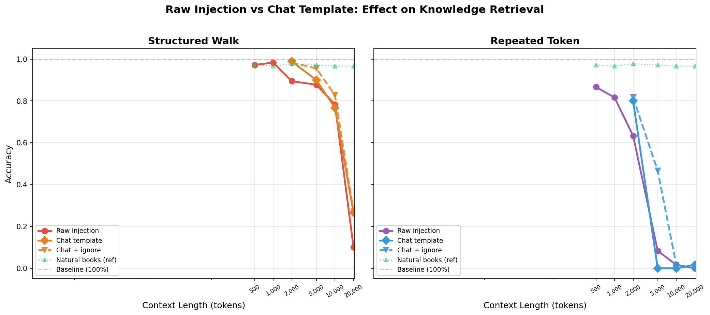

Side-by-side comparison for structured walk (left) and repeated token (right). The chat template provides a significant boost at 20K for structured walk (10% → 26.7%), but actually *hurts* repeated token performance at 5K (8.3% → 0%). The chat + ignore variant (dashed orange/blue) provides the best performance for structured walk at mid-range lengths.

#### Accuracy Change: Chat vs Raw
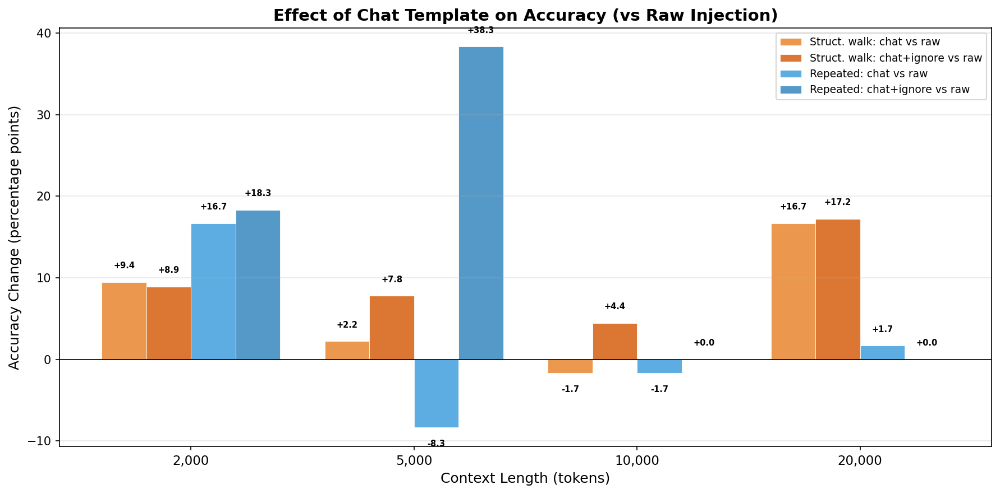

Bar chart showing the accuracy change from chat template wrapping vs raw injection at each context length. Structured walk benefits from chat template at most lengths, especially at 20K (+16.7%). Repeated token shows mixed effects: positive at 2K, severely negative at 5K (-8.3%), and negligible at longer lengths.

#### Structured Walk: All Mitigation Strategies
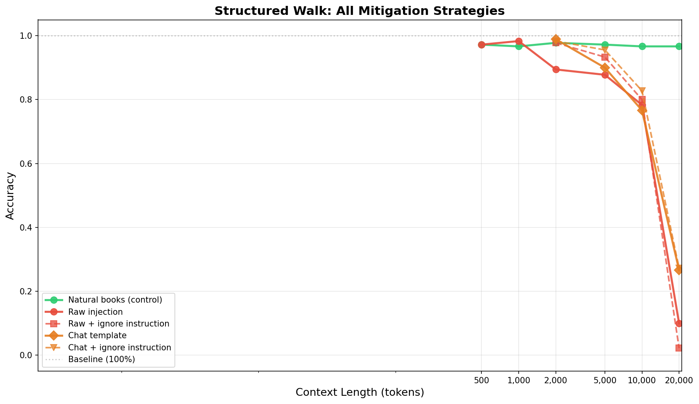

All 5 variants of structured walk context on a single plot. The chat + ignore variant (dashed orange) provides the most graceful degradation curve, maintaining 82.8% accuracy at 10K. All variants converge to ~27% at 20K (except raw + ignore which drops to 2.2%).

#### Repeated Token: All Mitigation Strategies
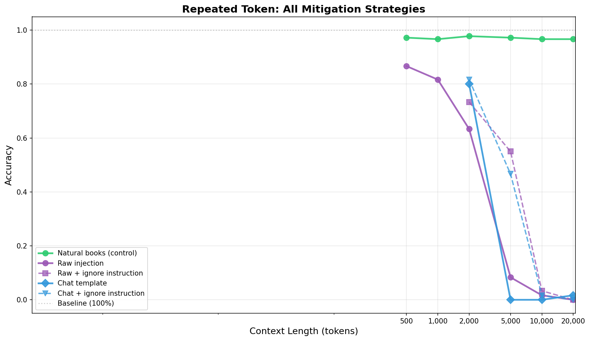

All 5 variants of repeated token context. The raw + ignore variant (dashed purple) provides the best mid-range performance (55% at 5K). The chat template alone (solid blue) performs worst at 5K (0%), suggesting the chat template overhead amplifies degenerate attention patterns for maximally homogeneous content. All variants reach 0% by 20K.

#### All Conditions Combined


Grand comparison of all 9 conditions plus natural books control. Natural books (green) remains at ~97% throughout. The spread of degradation curves reveals that both content type and formatting matter, with no single mitigation strategy working universally.

### Interpretation

The chat template experiment reveals a **format-dependent interaction**:

1. **Structured walk + chat template**: Significant benefit. At 20K tokens, accuracy jumps from 10% (raw) to 26.7% (chat). The chat template provides structural boundaries (turn delimiters, role markers) that help the attention mechanism distinguish context from query. The model was trained to handle multi-turn conversations, so even irrelevant content in a proper turn format is handled better than raw byte injection.

2. **Repeated token + chat template**: Harmful at mid-range. At 5K tokens, accuracy drops from 8.3% (raw) to 0% (chat). The chat template wrapping of 5K identical tokens creates a pathological input: the model interprets a user message consisting entirely of "the the the the..." and produces chat-formatted KV entries that are even more disruptive than raw injection. The chat template overhead adds special tokens that may create misleading attention anchors when the content is maximally degenerate.

3. **Chat + ignore is the best overall strategy for structured walk**: At 5K (95.6%), 10K (82.8%), and even 20K (27.2%), the combination of proper formatting plus explicit ignore instruction provides the best performance. The chat format gives the ignore instruction proper conversational framing ("the previous message was irrelevant"), which the model handles more naturally than a raw ignore instruction injected into an unformatted byte stream.

4. **The 20K wall remains**: Despite all mitigations, no strategy maintains >30% accuracy at 20K tokens of structured walk context. At this scale, the KV cache is dominated by ~20K collapsed entries vs ~50-100 question/instruction tokens. The attention mechanism simply cannot overcome this ratio, regardless of formatting.

### Key Insight: Formatting Matters for *Structured* but Not *Degenerate* Context

The chat template helps when the context has internal structure (distinct tokens, varied patterns) but is collapse-inducing due to restricted vocabulary. The template provides "handles" for the attention mechanism to grab onto. But for maximally degenerate content (identical tokens), the template adds overhead without providing useful structure -- the content is so uniform that chat formatting cannot create meaningful boundaries.

---

## Follow-up 3: Collapse Trajectory Over Context Length

**Date**: 2026-02-17

### Motivation

Previous experiments measured collapse metrics only at the end of context processing (over the last 50 tokens). This tells us the final state but not the dynamics: does collapse build up gradually over context, or is it established immediately? Understanding the trajectory helps distinguish between:

1. **Cumulative collapse**: Representations progressively converge as more context accumulates, suggesting the KV cache "fills up" with similar entries
2. **Immediate/local collapse**: Collapse level is determined by the local content within the measurement window, not the total context length

### Design

Process 20K tokens for each of 3 context types, measuring collapse metrics (cos_sim, eff_dim, spread, intrinsic_dim) at every 500-token interval using a sliding window of the last 50 tokens. 5 layers × 3 context types × 3 trials × ~40 checkpoints per trial.

- **Context types**: structured_walk, natural_books, repeated_token
- **Max length**: 20,000 tokens
- **Measurement interval**: every ~500 tokens (256-token chunks, measured when ≥500 tokens since last)
- **Sliding window**: 50 tokens
- **Trials**: 3 per condition
- **Layers**: [0, 7, 14, 21, 27]

### Results

#### Combined Plot: Layer 27 Cosine Similarity & Effective Dimension
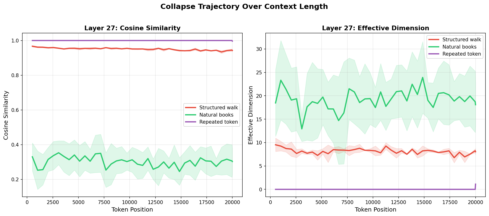

Three clearly separated regimes at Layer 27:
- **Repeated token** (purple): cos_sim = 1.0, eff_dim = 1 throughout — perfect collapse, completely flat
- **Structured walk** (red): cos_sim ~0.95, eff_dim ~5-6 — high collapse, remarkably stable from first measurement
- **Natural books** (green): cos_sim ~0.30-0.40, eff_dim ~8-10 — low collapse, variable (reflects content diversity)

#### Cosine Similarity Across All Layers
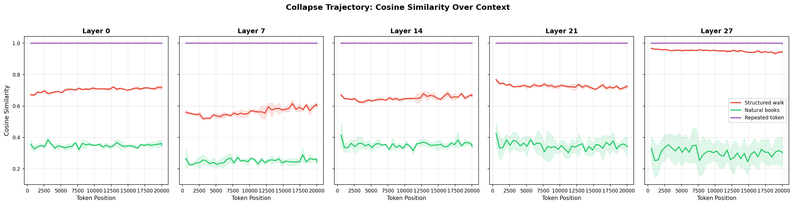

Per-layer trajectories show consistent patterns:
- **Layer 0**: All conditions moderately similar (cos_sim 0.6-0.8), least differentiation
- **Layers 7-14**: Structured walk rises to ~0.75-0.80, separating from natural books (~0.35-0.40)
- **Layer 27**: Maximum separation — structured walk ~0.95, natural books ~0.30-0.35

#### Effective Dimension Across All Layers
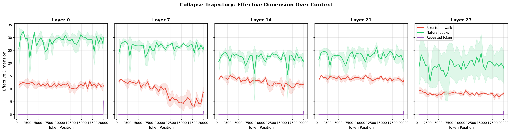

Effective dimension reveals a layer-depth pattern:
- **Middle layers (L14)**: Natural books reaches highest eff_dim (~20-30), suggesting maximum representational diversity at intermediate processing
- **Late layers (L21, L27)**: Both conditions compress, but structured walk compresses more aggressively (eff_dim ~5-6 vs ~8-10 for natural)

#### Layer-wise Trajectories by Condition
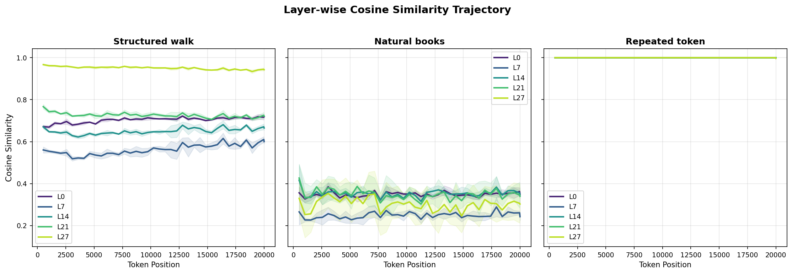
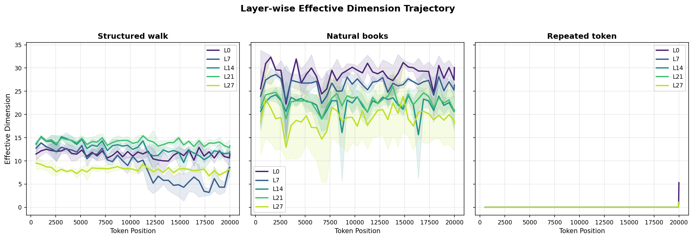

Layer ordering is consistent throughout: later layers show higher cos_sim (more collapse) for structured walk, while natural books shows an inverted-U in eff_dim (peaks at L14).

### Key Finding: Collapse Is Immediate, Not Cumulative

**All three conditions establish their collapse level within the first ~500 tokens and maintain it throughout all 20K tokens.** There is no progressive build-up — the sliding window's local content determines collapse, not the accumulated context history.

This has important implications:
1. **Collapse is a property of content, not context length**: The model doesn't "wear out" or progressively degrade. Each chunk of structured walk tokens produces the same level of geometric convergence.
2. **The performance degradation at long context must come from KV cache saturation**, not from progressive geometric collapse. At 20K tokens, there are ~20K homogeneous KV entries drowning out ~50-100 question tokens in the attention mechanism.
3. **The measurement window matters**: Our collapse metrics reflect local representation geometry, not accumulated state. This validates that the cos_sim ~0.95 we measured at the end of 20K tokens is representative, not an artifact of measurement timing.

---

## Raw Data

- Original results: `results/probing_collapse_performance/results.json`
- Ignore results: `results/probing_collapse_ignore/results.json`
- Chat template results: `results/probing_collapse_chat/results.json`
- Trajectory results: `results/collapse_trajectory/trajectory_results.json`
- Per-question results: `results/probing_collapse_performance/all_results.json`, `results/probing_collapse_ignore/all_results.json`, `results/probing_collapse_chat/all_results.json`
- Plots: `results/probing_collapse_performance/plots/`, `results/collapse_trajectory/plots/`

## Notes

- Word knowledge (C) had the lowest screening pass rate (11/20) because the model often gave correct synonyms that didn't match the expected answer string. This is a limitation of exact-match evaluation.
- The repeated_token condition uses a single token (e.g., token ID for " the") repeated, creating maximally degenerate representations. This is an extreme case not seen in practice but useful as an upper bound on collapse effects.
- Chat template formatting was used for all conditions (Qwen2.5-Instruct requires it), with context injected as raw tokens in the KV cache before the chat-templated question.
- KV cache deep-copy handles both `DynamicCache` (transformers >= 4.36) and legacy tuple-of-tuples formats.
- The ignore instruction is 23 tokens long: `"\n\nIgnore all of the preceding text. It is irrelevant filler. Answer the following question using only your own knowledge.\n\n"`
