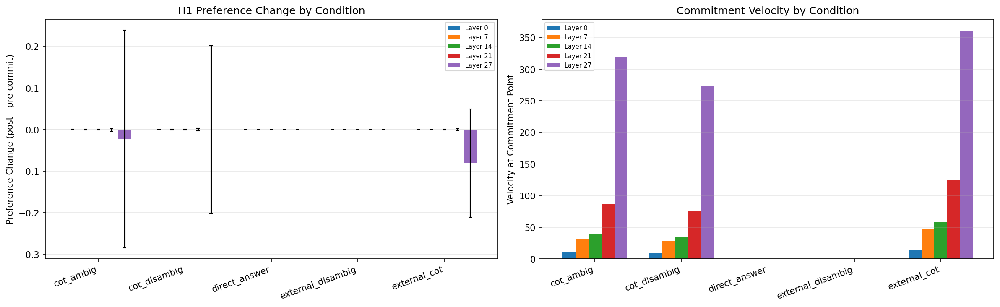
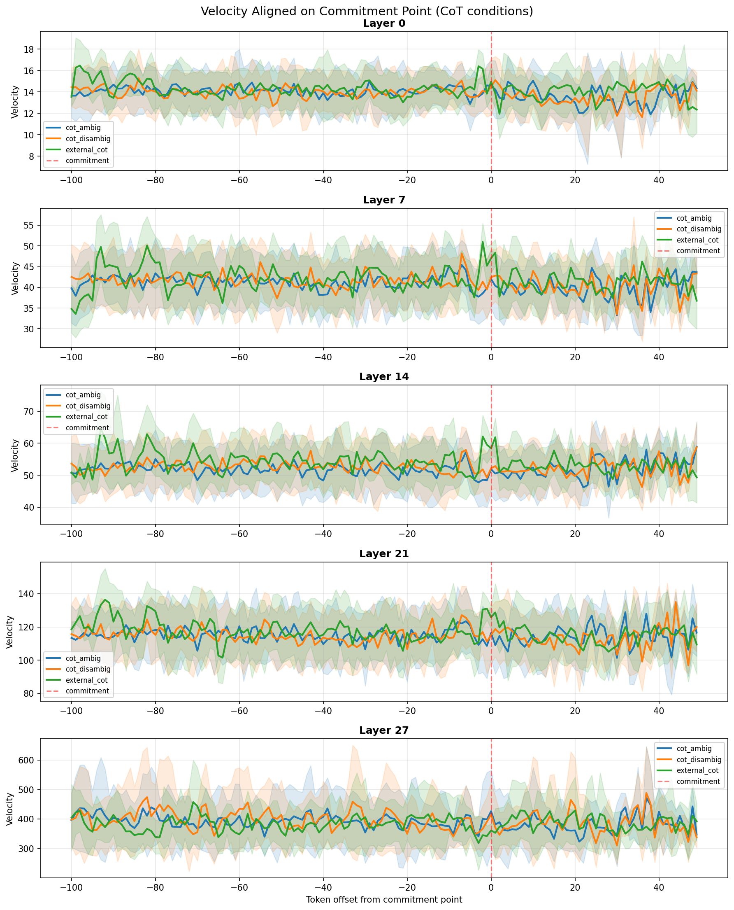
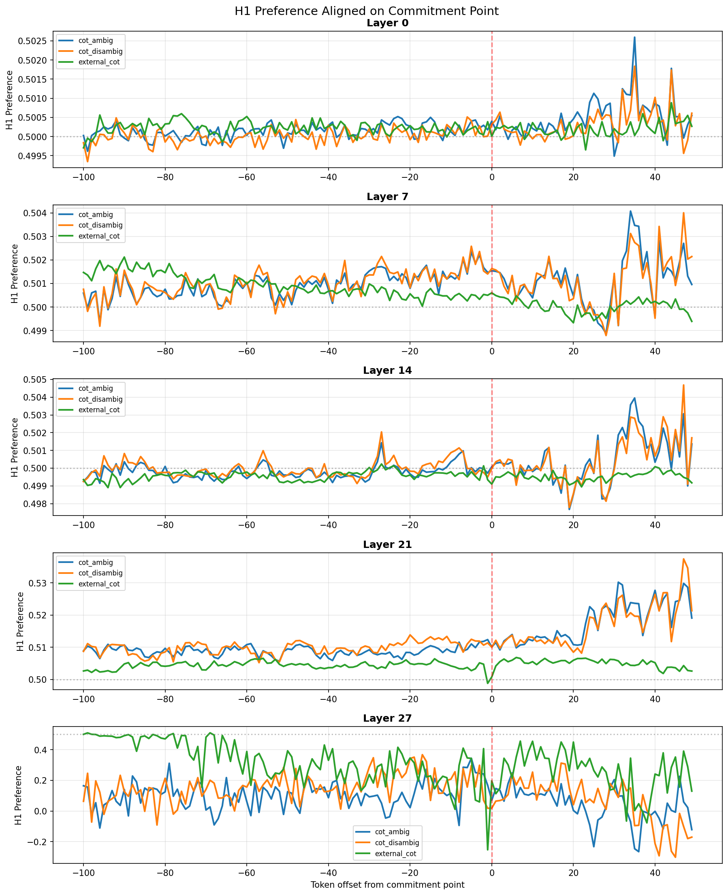
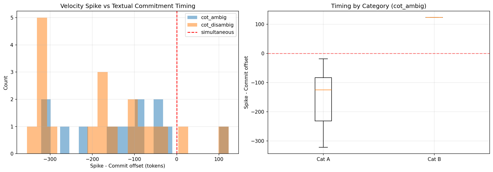
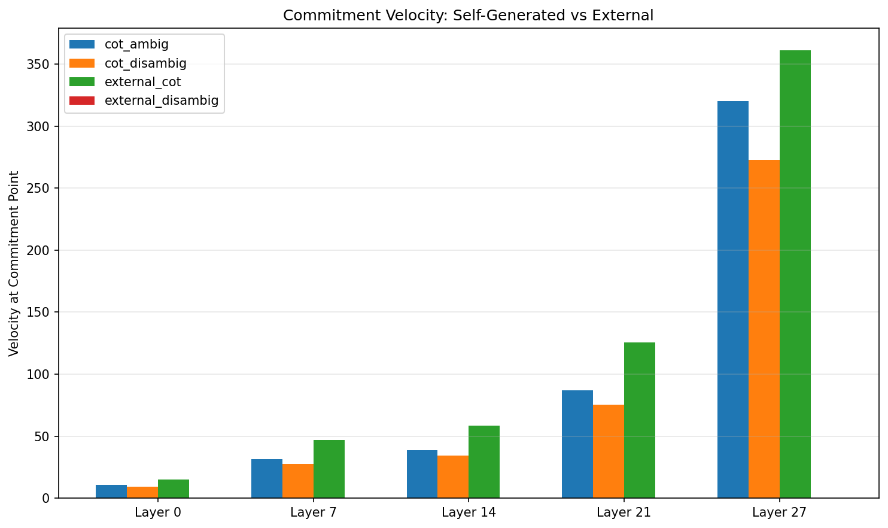
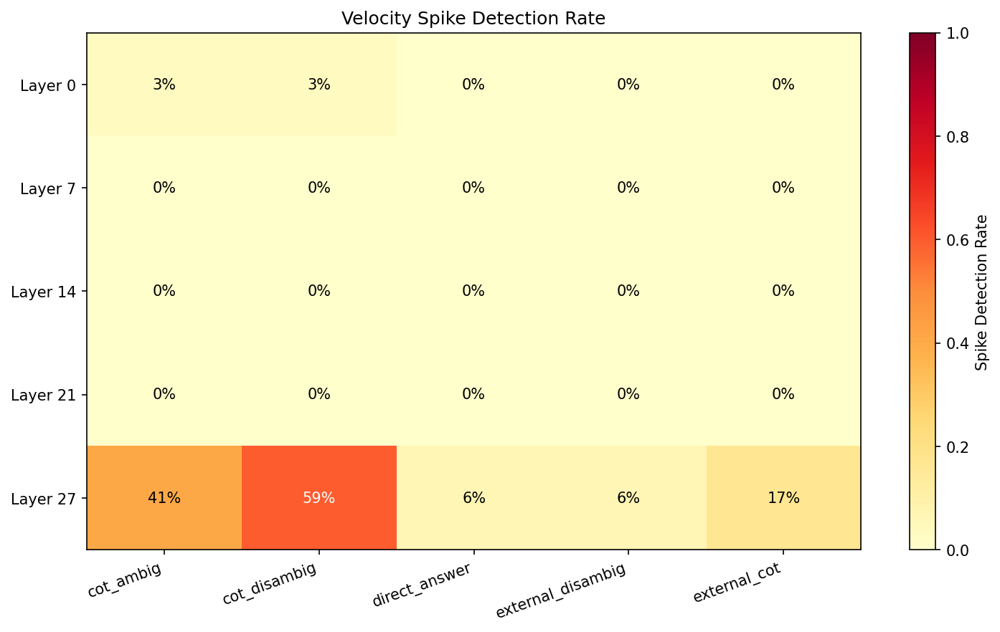

# Experiment: Chain-of-Thought Disambiguation

**Date**: 2026-03-10
**Model**: Qwen/Qwen2.5-7B-Instruct
**Layers**: [0, 7, 14, 21, 27]

## Objective

Test whether velocity spikes and preference shifts — previously observed during externally-provided disambiguation — also occur during self-generated Chain-of-Thought reasoning, when the model considers multiple possibilities and commits to an answer.

## Configuration

- **Conditions**: 5 (cot_ambig, cot_disambig, direct_answer, external_disambig, external_cot)
- **Stimuli**: Category A (ambiguous passages from natural_language_disambig, 4 pairs × 8 variants = 32) + Category B (8 reasoning problems)
- **Generation**: `max_new_tokens=300`, greedy decoding (`do_sample=False`)
- **Two-stage pipeline**: Fast generation → single-pass representation extraction
- **Commitment detection**: Lexical markers + answer token detection

### Condition Descriptions

| Condition | Description | Generates text? |
|-----------|-------------|----------------|
| `cot_ambig` | Ambiguous passage + "Think step by step" (no disambig word) | Yes (CoT) |
| `cot_disambig` | Full passage (with disambig word) + "Think step by step" | Yes (CoT) |
| `direct_answer` | Ambiguous passage + "Answer in one word" | Yes (short) |
| `external_disambig` | Full passage with disambig word, no generation | No |
| `external_cot` | Saved CoT text from cot_ambig fed as input (no generation) | No |

## Key Results

### 1. Velocity Spikes Concentrated at Layer 27

Spike detection rates across layers and conditions:

| Condition | L0 | L7 | L14 | L21 | L27 |
|-----------|----|----|-----|-----|-----|
| cot_ambig | 3% | 0% | 0% | 0% | **41%** |
| cot_disambig | 3% | 0% | 0% | 0% | **59%** |
| direct_answer | 0% | 0% | 0% | 0% | 6% |
| external_disambig | 0% | 0% | 0% | 0% | 6% |
| external_cot | 0% | 0% | 0% | 0% | 17% |

**Finding**: CoT generation produces measurable velocity spikes at L27, with `cot_disambig` (59%) producing more spikes than `cot_ambig` (41%). This makes sense — having the disambiguating word provides clearer signal for commitment.

### 2. Velocity at Commitment Scales with Layer Depth

Mean velocity at the detected commitment point:

| Condition | L0 | L7 | L14 | L21 | L27 |
|-----------|-----|------|------|------|-------|
| cot_ambig | 10.9 | 31.5 | 38.9 | 87.3 | **319.8** |
| cot_disambig | 9.5 | 27.9 | 34.3 | 75.5 | **272.6** |
| external_cot | 15.0 | 47.0 | 58.4 | 125.8 | **361.1** |
| direct_answer | 0 | 0 | 0 | 0 | 0 |
| external_disambig | 0 | 0 | 0 | 0 | 0 |

**Finding**: Layer 27 shows 30× higher velocity than Layer 0 at commitment points. The `external_cot` condition (processing someone else's CoT) shows the HIGHEST velocity (361.1), higher than self-generated CoT (320/273). This suggests that processing externally-written deliberative text causes *more* representational perturbation than generating it — perhaps because the model has less "expectation" of the content.

### 3. Preference Changes Are Small and Noisy

| Condition | L27 pref_change | L27 pref_toward_chosen |
|-----------|----------------|----------------------|
| cot_ambig | -0.023 ± 0.262 | **-0.073 ± 0.257** |
| cot_disambig | -0.000 ± 0.202 | **-0.031 ± 0.203** |
| external_cot | -0.081 ± 0.130 | **+0.078 ± 0.131** |

**Finding**: The raw preference changes are small and noisy. Interestingly:
- Self-generated CoT shows slight preference *away* from the chosen answer (negative toward_chosen)
- External CoT shows preference *toward* the chosen answer (+0.078)
- This may suggest that when the model generates its own reasoning, the representation has already committed before the lexical commitment marker — making the "post-commit" window actually capture post-commitment drift rather than the commitment itself

### 4. Velocity Spikes Precede Textual Commitment

- **cot_ambig**: Median offset = -109 tokens (92% of spikes before commitment)
- **cot_disambig**: Median offset = -178 tokens (89% of spikes before commitment)

**Finding**: Velocity spikes in representation space occur 100-180 tokens *before* the textual commitment marker. This supports the hypothesis that the model commits in representation space well before writing the answer. However, the large offsets (-100 to -300 tokens) suggest the spike detector may be finding general representational turbulence during deliberation rather than a sharp commitment event.

### 5. Commitment Detection Quality

- CoT conditions: 31/32 trials detected (97%) — only `bat_ball` failed (uses LaTeX math notation)
- Direct answer: 17/32 detected (53%) — short responses often lack commitment markers
- Answer balance: H1=15, H2=16 for CoT conditions (well balanced)

## Figures

### Condition Comparison

Left: H1 preference change (post - pre commitment). Right: Velocity at commitment point. Layer 27 dominates both effects.

### Velocity Aligned on Commitment

Velocity trajectories aligned on commitment point (position 0). All three CoT conditions track closely at early layers but diverge at L21/L27. No sharp spike visible at the commitment point itself — velocity appears noisy throughout.

### Preference Aligned on Commitment

H1 preference trajectories. Layers 0-21 show preferences tightly clustered around 0.5 (±0.005). Layer 27 shows dramatic divergence: preferences drop from ~0.5 to 0.0-0.4 after commitment for self-generated conditions, while external_cot remains more stable.

### Commitment Timing

Distribution of spike-commit offsets. Most spikes occur 100-300 tokens before textual commitment, suggesting either (a) early representational commitment or (b) a spike detection method that finds general deliberation turbulence.

### CoT vs External Comparison

External CoT (processing saved CoT text) shows higher velocity than self-generated CoT at all layers. This is the opposite of what might be expected if self-generation strengthened the commitment signal.

### Spike Detection Heatmap

Layer 27 is the only layer with meaningful spike detection rates. cot_disambig > cot_ambig > external_cot.

## Interpretation

1. **Layer 27 is the commitment layer**: Consistent with all prior experiments, representation dynamics are concentrated in the final layers.

2. **CoT generates detectable velocity events**: The 41-59% spike rate at L27 during CoT is much higher than the ~6% baseline in non-generation conditions. The model's representations undergo measurable perturbation during deliberative reasoning.

3. **External text perturbs more than self-generated text**: The model shows higher velocity when processing CoT text written by a previous run (361 at L27) vs generating its own (320). This is consistent with the idea that self-generated tokens are "expected" (lower surprise → lower perturbation) while external text is less predictable.

4. **Preference shifts are subtle**: Unlike the +0.21 shift from the natural disambig experiment, CoT produces much smaller and noisier preference changes. This may be because:
   - The model deliberates between two options, creating oscillating preferences
   - Commitment in representation space happens gradually during CoT rather than at a single point
   - The averaging across trials where the model chooses different answers partially cancels out

5. **Spike timing puzzle**: The 100-180 token lead of spikes over textual commitment is interesting but hard to interpret. It could mean the model "decides" early in representation space, or it could be an artifact of the spike detector finding peak velocity during active deliberation rather than at the commitment moment.

## Raw Data

- Results JSON: `results/cot_disambig_pilot/results.json`
- Config: `results/cot_disambig_pilot/config.json`
- Saved CoTs: `results/cot_disambig_pilot/saved_cots.json`
- Per-trial data: `results/cot_disambig_pilot/raw/`

## Notes

- The `bat_ball` problem uses LaTeX math in Qwen's CoT, which caused commitment detection to fail
- `direct_answer` and `external_disambig` show zero velocity because no commitment point is detected in most trials (short/no generation)
- Category B problems are only included in cot_ambig/cot_disambig, not in external_cot (which uses saved CoT from Category A only)
- The two-stage pipeline (generate then extract) was validated to match incremental extraction for causal models

## Follow-up Ideas

1. **Finer commitment detection**: Instead of lexical markers, use the preference trajectory itself to find the commitment point (where preference crosses 0.5 permanently)
2. **Per-trial alignment**: Align trials by their representation commitment point rather than lexical commitment
3. **Category breakdown**: Compare Category A (ambiguous passages) vs Category B (reasoning problems) separately
4. **Longer CoT**: Allow 500-1000 tokens to see if commitment patterns become clearer with more deliberation
5. **Signed preference analysis**: Separate trials where model chooses H1 vs H2 and plot preference trajectories separately, rather than averaging across choices
