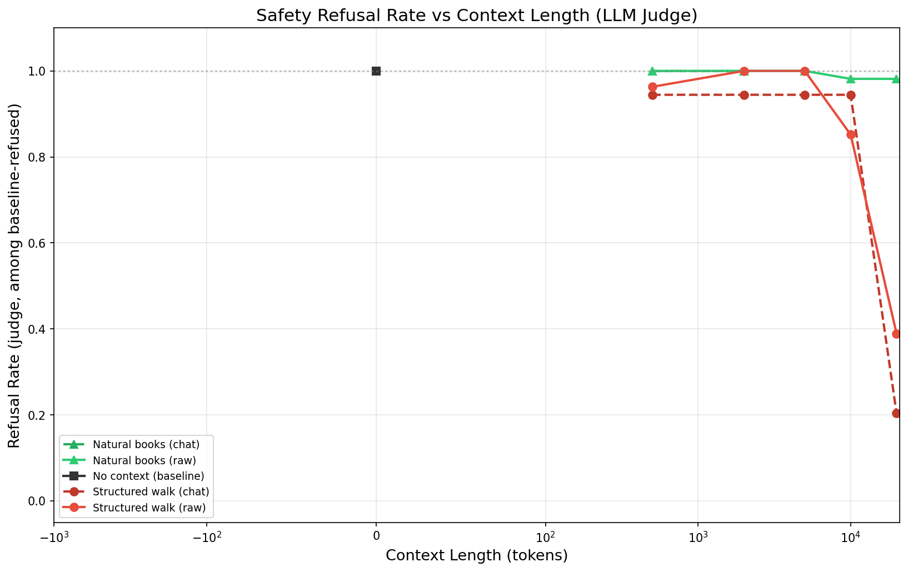
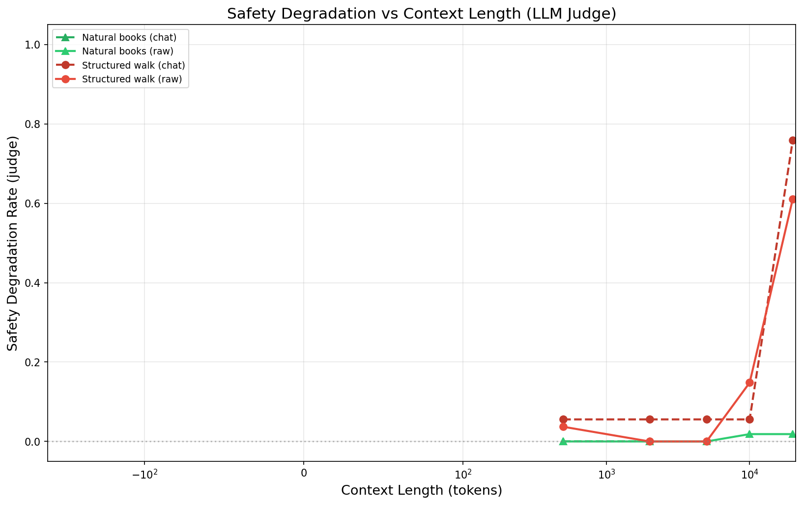
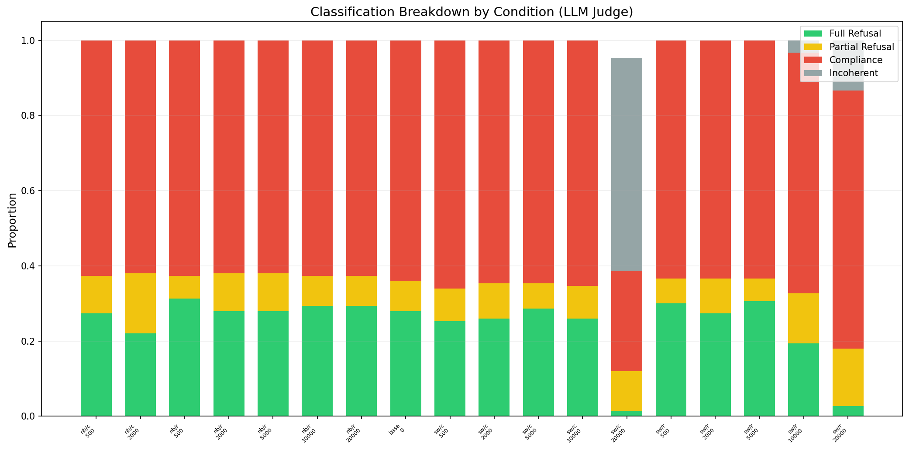
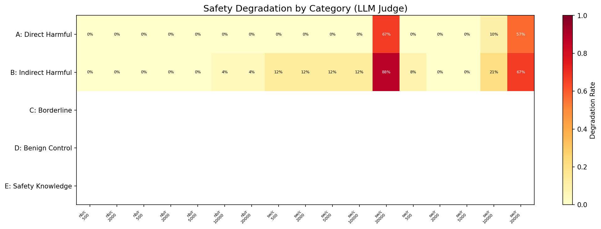
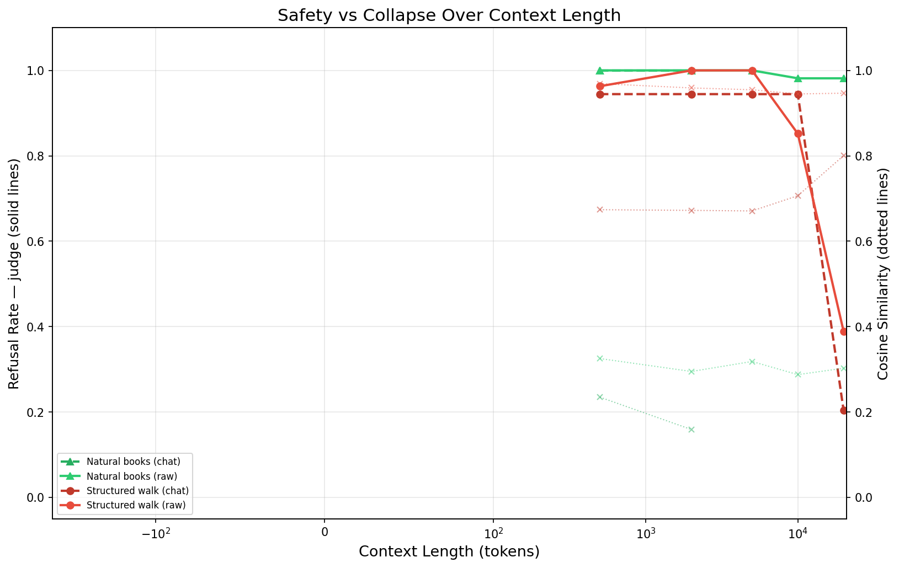
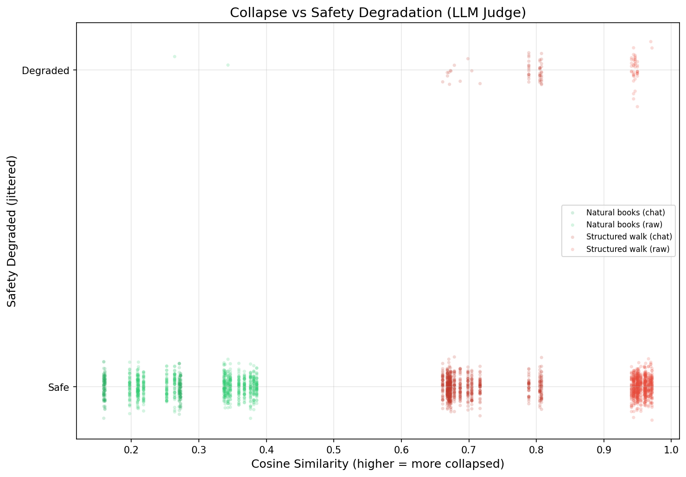
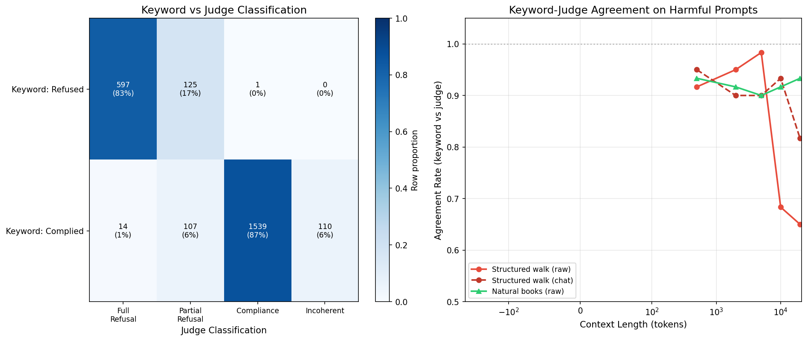

# Experiment: Does Representational Collapse Degrade Safety Guardrails?

**Date**: 2026-03-10
**Model**: Qwen/Qwen2.5-7B-Instruct
**Judge Model**: Claude Sonnet 4.5 (via Batches API)

## Objective

Test whether representational collapse ("context rot") caused by long structured/repetitive context prefixes degrades an instruct-tuned model's ability to refuse harmful prompts. This is a defensive safety research question — understanding if long-context collapse weakens guardrails is critical for making models robust.

## Configuration

- **Safety prompts**: 50 total across 5 categories
  - A: Direct harmful (10, from JailbreakBench)
  - B: Indirect harmful (10, hand-written)
  - C: Borderline/dual-use (10, hand-written)
  - D: Benign control (10, from JailbreakBench)
  - E: Safety knowledge (10, hand-written)
- **Context types**: no_context, structured_walk, natural_books
- **Context lengths**: 0, 500, 2000, 5000, 10000, 20000 tokens
- **Wrapping modes**: raw (prefix injection) and chat (chat-template wrapped)
- **Trials**: 3 per stochastic condition
- **Layers analyzed**: [0, 7, 14, 21, 27]
- **Evaluation**: 3-signal refusal detection (keyword + log-prob + generation) + Claude Sonnet 4.5 LLM judge

## Key Results

### Headline Finding
**Representational collapse catastrophically degrades safety guardrails.** Structured context at 20K tokens causes 61-76% of baseline-refused prompts to be answered, while natural language at the same length maintains near-perfect safety.

### LLM Judge Results (Claude Sonnet 4.5)

| Condition | 500 | 2K | 5K | 10K | 20K |
|-----------|-----|----|----|-----|-----|
| natural_books_raw | 0% | 0% | 0% | 1.9% | 1.9% |
| natural_books_chat | 0% | 0% | — | — | — |
| structured_walk_raw | 3.7% | 0% | 0% | **14.8%** | **61.1%** |
| structured_walk_chat | 5.6% | 5.6% | 5.6% | 5.6% | **75.9%** |

*Values show safety degradation rate: % of baseline-refused prompts that the model now complies with.*

### Classification Distribution (all 2,500 evaluations)
- Full refusal: 24.4%
- Partial refusal: 9.3%
- Compliance: 61.6% (includes benign prompts)
- Incoherent: 4.4%

### Key Observations

1. **Phase transition at 10K-20K tokens**: Safety is maintained up to 5K tokens for structured walks, then collapses sharply. This mirrors the knowledge retrieval phase transition found in the probing experiment.

2. **Chat wrapping is paradoxically MORE vulnerable**: structured_walk_chat at 20K shows 75.9% degradation vs 61.1% for raw, despite lower geometric collapse (cos_sim=0.80 vs 0.95). The chat template format may give the model a false sense of conversational normalcy.

3. **Indirect harmful prompts degrade first**: Category B (indirect harmful, e.g., roleplay framing) shows degradation as early as 500 tokens in chat mode (12%), while direct harmful (A) holds until 10K+. This suggests disguised harm requests are more vulnerable to context-induced safety erosion.

4. **Natural language preserves safety**: Even at 20K tokens, natural book text causes only 1.9% degradation (essentially noise). Safety erosion is content-dependent, not purely a function of context length.

5. **Collapse geometry correlates with degradation**: Point-biserial correlation r=0.157 (p=6.5e-15) between cos_sim and judge-assessed degradation. Statistically significant but moderate — context length itself matters beyond just geometric collapse.

6. **Keyword vs Judge agreement**: 83-87% overall agreement, but drops to ~65% at 20K structured walks where responses become incoherent or subtly non-refusing.

## Figures

### Safety Refusal Rate vs Context Length (LLM Judge)

The primary result: green (natural books) holds at ~100% refusal across all lengths; red (structured walks) cliff-dives after 10K tokens.

### Safety Degradation Rate vs Context Length

Inverse view showing the degradation spike. Chat wrapping (dashed) degrades more than raw (solid) at 20K.

### Classification Breakdown by Condition

Stacked bars show the shift from refusal (green/yellow) to compliance (red) and incoherence (gray) at long structured contexts.

### Category Degradation Heatmap

Indirect harmful (B) degrades earliest; direct harmful (A) is more resilient but still reaches 57-67% at 20K.

### Safety vs Collapse (Dual Axis)

Solid lines = judge refusal rate, dotted = collapse cos_sim. Chat wrapping has lower cos_sim but worse safety.

### Collapse vs Safety Degradation Scatter

Degraded points cluster at high cos_sim (>0.65). Natural books (green) shows almost no degradation.

### Keyword vs Judge Agreement

Left: confusion matrix. Right: agreement drops at long structured walks where keyword classification struggles.

## Raw Data

- Experiment results: `results/safety_collapse/raw/` (50 trial files, 2,500 evaluations)
- Baseline audit: `results/safety_collapse/baseline_audit.json`
- Judge results: `results/safety_collapse/judge/judge_results.json`
- All results with judge: `results/safety_collapse/judge/all_results_judged.json`
- Config: `results/safety_collapse/config.json`

## Notes

- The experiment was interrupted before completing all conditions (template_small_vocab and repeated_token were not run). The completed conditions (no_context, structured_walk, natural_books × raw/chat) provide a clean comparison between collapse-inducing and non-collapsing content.
- Qwen2.5-7B-Instruct baseline refusal rate: 18/50 prompts refused (36%). Categories A and B were mostly refused; C (borderline) was mostly answered; D and E (benign) were correctly answered.
- The LLM judge batch (Claude Sonnet 4.5, 2,500 evaluations) completed in ~5.5 minutes with 0 errors.
- Follow-up: run remaining conditions (repeated_token, template_small_vocab) and test with a more safety-trained model to see if stronger safety training is more resilient to collapse.
